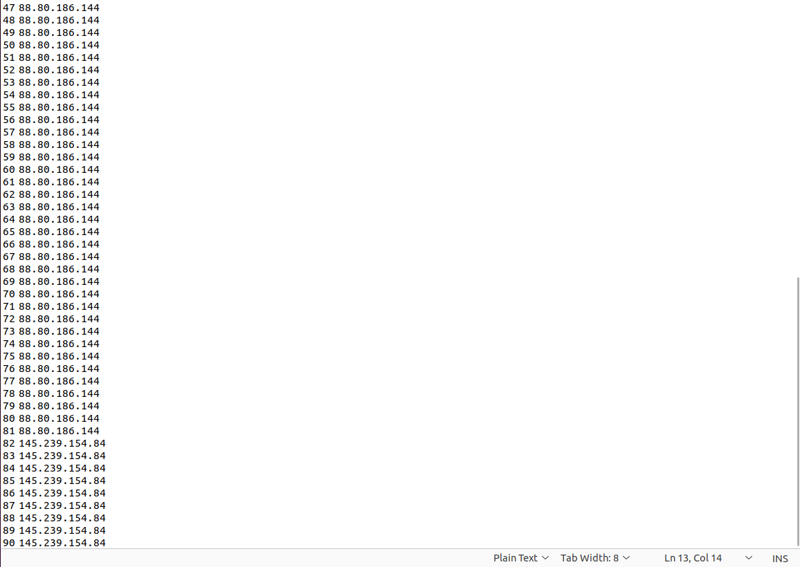

# soal-shift-sisop-modul-1-ITB01-2022

# Kelompok ITB01 Sistem Operasi B

- I Putu Windy Arya Sagita 5027201071
- Fatchia Farhan 5027201044
- Surya Zandra Anggoro 5027201018

# Soal

Link soal : [Soal Shift 1](https://docs.google.com/document/d/13lHX4hO09jf07y_JFv0BpwunFL-om9eiNFDlIooSW3o/edit)

---

## Soal 1

Oleh Fatchia Farhan

### Narasi Soal

Pada suatu hari, Han dan teman-temannya diberikan tugas untuk mencari foto. Namun, karena laptop teman-temannya rusak ternyata tidak bisa dipakai karena rusak, Han dengan senang hati memperbolehkan teman-temannya untuk meminjam laptopnya. Untuk mempermudah pekerjaan mereka, Han membuat sebuah program.

### # A


Han membuat sistem register pada script register.sh dan setiap user yang berhasil didaftarkan disimpan di dalam file ./users/user.txt. Han juga membuat sistem login yang dibuat di script main.sh

---
**Penyelesaian A**

Di sini Han diminta untuk membuat file register.sh, user.txt dan main.sh.

Hal pertama yang dilakukan adalah membuat file user.txt dan log.txt di direktori yang sudah ditentukan menggunakan mkdir kemudian menggunakan test -f untuk mencari file apakah sudah tersedia atau belum dan jika belum maka akan dijalankan fungsi touch untuk membuat file user.txt dan log.txt.
```
mkdir -p ./users
test -f ./users/user.txt || touch ./users/user.txt
test -f log.txt || touch log.txt
```
---
### # B
Demi menjaga keamanan, input password pada login dan register harus tertutup/hidden dan password yang didaftarkan memiliki kriteria sebagai berikut

* Minimal 8 karakter
* Memiliki minimal 1 huruf kapital dan 1 huruf kecil
* Alphanumeric
* Tidak boleh sama dengan username
---

**Penyelesaian B**

Pada soal ini diperlukan membuat kode untuk menginputkan username dan password dengan ketentuan-ketentuan yang sudah ditentukan. Langkah-langkah untuk mengerjakannya adalah sebagai berikut.

Sebelum menetapkan syntax untuk memenuhi kondisi password yang diperlukan, digunakan fungsi read -p terlebih dahulu untuk menginputkan username yang dimau dan dimasukkan ke dalam variabel username. Kemudian menggunakan fungsi timedate() untuk memunculkan waktu dan tanggal secara otomatis. Selanjutnya ts untuk memanggil fungsi timedate tadi. 

Untuk memenuhi beberapa kondisi yang ditentukan untuk passwordnya, di sini digunakan fungsi checkpass() dan di-loop dengan syntax sebagai berikut:
```
checkpass() {
	until [[ ! "$password" == "$username" && ${#password} -ge 8 && "$password" == *[A-Z]* && "$password" == *[a-z]* && "$password" == *[1-9]* ]];
	do
		echo "Password Tidak Sesuai Kriteria!"
		echo "password: " 
		stty -echo 
			read password
		stty echo
	done
}
```
### # C
Setiap percobaan login dan register akan tercatat pada log.txt dengan format : MM/DD/YY hh:mm:ss MESSAGE. Message pada log akan berbeda tergantung aksi yang dilakukan user.

* Ketika mencoba register dengan username yang sudah terdaftar, maka message pada log adalah REGISTER: ERROR User already exists
* Ketika percobaan register berhasil, maka message pada log adalah REGISTER: INFO User USERNAME registered successfully
* Ketika user mencoba login namun passwordnya salah, maka message pada log adalah LOGIN: ERROR Failed login attempt on user USERNAME
* Ketika user berhasil login, maka message pada log adalah LOGIN: INFO User USERNAME logged in

---
**Penyelesaian C**

Dilakukan penulisan fungsi timedate() untuk memanggil waktu dan tanggal secara otomatis. Kemudian menggunakan ts=$timedate untuk memanggil waktu dan tanggal tersebut.

Untuk memunculkan message pada log ketika username sudah tersedia, digunakan fungsi checkuname() dengan syntax sebagai berikut:
```
checkuname() {
	until ! grep -q "$username" ./users/user.txt;
do
	echo "username already exists"
	echo "$ts REGISTER: ERROR user already exists" >> log.txt
	read -p 'new username: ' username
done
```
Jika percobaan register berhasil, maka akan dimunculkan sebuah message pada log dengan syntax sebagai berikut:
```
echo "REGISTER: INFO User $username registered successfully" >> log.txt
```

Kemudian untuk memberikan peringatan jika user login dengan password yang salah, maka digunakan fungsi verifyunamepass() dengan syntax sebagai berikut:
```
verifyunamepass() {
	true=$(awk -v username="${username}" -v password="${password}" '$1==username && $2==password {print 1}' ./users/user.txt)

	until [[ "$true" == 1 ]];
	do
		echo "$ts LOGIN: ERROR Failed login attempt on user $username" >> log.txt
		read -p 'Username: ' username
		echo "Password: "
		stty -echo
			read password
		stty echo
		true=$(awk -v username="${username}" -v password="${password}" '$1==username && $2==password {print 1}' ./users/user.txt)
	done
}
```
Selanjutnya jika percobaan login sebuah user berhasil, maka akan keluar message pada log menggunakan syntax sebagai berikut:
```
echo "$ts LOGIN: INFO User $username logged in" >> log.txt
``` 
setelah menjalankan fungsi verifyunamepass.

### # D
Setelah login, user dapat mengetikkan 2 command dengan dokumentasi sebagai berikut :

* dl N ( N = Jumlah gambar yang akan didownload): Untuk mendownload gambar dari https://loremflickr.com/320/240 dengan jumlah sesuai dengan yang diinputkan oleh user. Hasil download akan dimasukkan ke dalam folder dengan format nama YYYY-MM-DD_USERNAME. Gambar-gambar yang didownload juga memiliki format nama PIC_XX, dengan nomor yang berurutan (contoh : PIC_01, PIC_02, dst. ).  Setelah berhasil didownload semua, folder akan otomatis di zip dengan format nama yang sama dengan folder dan dipassword sesuai dengan password user tersebut. Apabila sudah terdapat file zip dengan nama yang sama, maka file zip yang sudah ada di unzip terlebih dahulu, barulah mulai ditambahkan gambar yang baru, kemudian folder di zip kembali dengan password sesuai dengan user.

* att: Menghitung jumlah percobaan login baik yang berhasil maupun tidak dari user yang sedang login saat ini.
---
**Penyelesaian D**

Di poin ini terdapat dua command yang dapat dilakukan, yaitu dl dan att.

Command dl berfungsi untuk men-download picture dari web yang sudah ditentukan dan jumlahnya juga dapat diinputkan oleh user menggunakan fungsi downloadpict(). Syntax-nya adalah sebagai berikut:
```
downloadpict() {
	sudo apt install zip unzip
	folder=`date +%F`"_$username"
	index=0
	if [[ ! -f "./$folder.zip" ]]
	then
		mkdir -p "./$folder"
	else
		unzip -P "$password" "./$folder.zip"
		file=`ls "$folder" -r | head -n 1`
		index=$(awk -F"_" '{print $2}' <<< "$file")
	fi
	for ((num=index+1; num<=index+q; num++))
	do
		wget -O "$folder/PIC_$num" https://loremflickr.com/320/240
	done
	zip -r -P "$password" "$folder.zip" "$folder"
	rm -rf "$folder"
}
```
Sudo digunakan untuk mengaktifkan fitur-fitur tertentu. Misalnya untuk melakukan zip unzip folder dengan syntax sudo apt install zip unzip. Kemudian penamaan folder dapat dilakukan menggunakan syntax 

```
folder=`date +%F`"_$username"
```
sehingga dapat sesuai dengan permintaan soal. 
Kemudian untuk pemberian nama digunakan syntax:
```
	for ((num=index+1; num<=index+q; num++))
	do
		wget -O "$folder/PIC_$num" https://loremflickr.com/320/240
	done
```
Selanjutnya untuk memasukkan password sebelum menjalankan fungsi zip menggunakan syntax:
```
zip -r -P "$password" "$folder.zip" "$folder"
```
Untuk menghitung jumlah percobaan login akun digunakan fungsi loginattempt() dengan syntax sebagai berikut:
```
loginattempt() {
	awk -v username="${username}" '$3=="LOGIN:" && ($6==username || $10==username) {++n} END {print "login attempt = " n}' log.txt
}
```
Username di kata ke 6 akan dihitung sebagai 1x login berhasil, dan username di kata ke 10 akan dihitung sebagai 1x login tidak berhasil.

Kemudian di akhir, untuk memanggil fungsi downloadpict dan logginattempt digunakan command 'dl' untuk downloadpict dan 'att' untuk loginattempt.

---

## Soal 2

Oleh I Putu Windy Arya Sagita

### Narasi Soal
Pada tanggal 22 Januari 2022, website https://daffa.info di hack oleh seseorang yang tidak bertanggung jawab. Sehingga hari sabtu yang seharusnya hari libur menjadi berantakan. Dapos langsung membuka log website dan menemukan banyak request yang berbahaya. Bantulah Dapos untuk membaca log website https://daffa.info Buatlah sebuah script awk bernama "soal2_forensic_dapos.sh" untuk melaksanakan tugas-tugas berikut: (Gunakan AWK dan semua file Hasil Saja yang akan dimasukan ke dalam folder forensic_log_website_daffainfo_log)

### # A
Buatlah folder dengan nama `forensic_log_website_daffainfo_log`

**Penyelesaian A**

Pada soal a ini, kita diberikan tugas untuk membuat folder/directory log terlebih dahulu dengan nama `forensic_log_website_daffainfo_log`. Berikut ini adalah kode yang kami gunakan untuk membuat directory tersebut.
```bash
mkdir -p ./forensic_log_website_daffainfo_log
```
Dari potongan kode di atas, ada command `mkdir -p` yang berfungsi untuk membuat directory jika belum ada directory tersebut pada sistem. Perintah ini tidak akan mengeluarkan error jika directory yang ingin kita buat sudah ada pada sistem. Perintah ini sangat membantu untuk membuat directory ketika kita tidak mengetahui apakah directory yang ingin kita buat sudah ada atau belum.

### # B
Dikarenakan serangan yang diluncurkan ke website https://daffa.info sangat banyak, Dapos ingin tahu berapa rata-rata request per jam yang dikirimkan penyerang ke website. Kemudian masukkan jumlah rata-ratanya ke dalam sebuah file bernama ratarata.txt ke dalam folder yang sudah dibuat sebelumnya.

**Penyelesaian B**

Pada soal b ini, kita akan mencari rata-rata request per jam nya dari log website daffainfo yang sudah diberikan. Berikut adalah kode yang kami gunakan untuk mencari rata-rata request per jam.
```bash
#rata-rata kunjungan
total=$(awk 'END{print NR-1}' log_website_daffainfo.log)
jamawal=$(awk -F ":" 'NR==2 {print $3}' log_website_daffainfo.log)
jamakhir=$(awk -F ":" 'END {print $3}' log_website_daffainfo.log)
tjam=$((jamakhir-jamawal))
avg=$((total/tjam)) 
echo "Rata-rata serangan adalah sebanyak $avg requests per jam" >> ./forensic_log_website_daffainfo_log/ratarata.txt
```
Pada kode di atas, pertama-tama kami mencari total request yang ada pada log menggunakan AWK dengan cara melakukan pointing ke baris paling akhir pada log dan melakukan print nomor baris terakhir. Jika dilihat pada log, nomor baris terakhir adalah 974, tetapi perlu diingat bahwa baris pertama pada log bukanlah sebuah request melainkan hanya judul untuk tiap kolomnya sehingga nomot baris terakhir yang kita dapat tadi perlu dikurangi 1 `NR-1` dan mendapatkan total request sebanyak 973. 

Kemudian, kami ingin mengambil jam pada request pertama yang masuk. Pada kali ini, kita perlu menspesifikasikan file separatornya agar kita dapat mengambil nilai jamnya saja. Separator yang digunakan adalah ":". Kemudian, karena request pertama ada pada baris kedua, maka kita set agar AWK mengambil line 2 saja dengan `NR==2`. Setelah itu, karena adanya separator ":", maka nilai jam yang awalnya ada pada kolom pertama `$1`, kemudian ada pada kolom ketiga `$3` sehingga kita print kolom ketiga `$3`. Setelah itu, kita juga perlu untuk mendapatkan nilai jam dari request terakhir dengan cara yang sama, perbedaannya hanya pada baris yang di-pointing saja, dimana sekarang kita melakukan pointing ke baris terakhir `END`.

Setelah mendapatkan total, jam request pertama, dan jam request terakhir, sekarang saatnya kita melakukan operasi. Operasi pertama adalah operasi untuk mendapatkan nilai total jam dari request terakhir dengan request pertama `tjam=$((jamakhir-jamawal))`. Kemudian, kita bisa melakukan operasi untuk mencari rata-rata dengan membagi total request dengan total waktu request `avg=$((total/tjam)) `. Terakhir, hasil rata-rata dimasukan ke dalam file txt yang diberi nama `ratarata.txt` pada directory `forensic_log_website_daffainfo_log`. Berikut adalah hasilnya:


### # C
Sepertinya penyerang ini menggunakan banyak IP saat melakukan serangan ke website https://daffa.info, Dapos ingin menampilkan IP yang paling banyak melakukan request ke server dan tampilkan berapa banyak request yang dikirimkan dengan IP tersebut. Masukkan outputnya kedalam file baru bernama result.txt kedalam folder yang sudah dibuat sebelumnya.

**Penyelesaian C**

Pada soal c ini, kita akan mencari IP yang melakukan request paling banyak ke server. Berikut adalah kode yang kami gunakan.
```bash
#ip address terbanyak
awk -F'"' '{ipc[$2]++;} END {max=0; for (IP in ipc) {if (ipc[IP] > max) {max = ipc[IP]; ipaddr = IP;}} printf("IP yang paling banyak mengakses server adalah: %s sebanyak %d requests\n", ipaddr, max)}' log_website_daffainfo.log >> ./forensic_log_website_daffainfo_log/result.txt
```
Pada kode AWK di atas, kami pertama-tama menspesifikasikan file separator yang kami gunakan, yaitu `"`. Kami menggunakan separator `"` karena pada log IP address diberikan tanda petik dua `"` pada awal dan akhirannya. Dengan demikian, IP address nantinya akan berada pada kolom 2 `$2` di log website. Di sini kami menggunakan array untuk mendapatkan jumlah dari tiap IP address `ipc[$2]`. Setelah sampai pada baris terakhir, kita akan mencari IP address mana yang paling banyak muncul dengan menggunakan `for` loop. Namun, sebelum itu kita deklarasikan terlebih dahulu variabel `max = 0` sebagai perbandingan untuk mencari IP address terbanyak. Kembali ke `for` loop, di dalam loop ini kita cek apakah jumlah request dari IP address yang saat ini lebih besar daripada jumlah IP address sebelumnya `if (ipc[IP] > max)`. Jika kondisi tersebut terpenuhi, maka kita ganti nilai pada `max` menjadi nilai jumlah IP address tersebut. Looping akan terus berlanjut hingga array sudah habis. Terakhir, hasil IP address dengan request terbanyak akan dioutputkan ke log `result.txt`. Berikut adalah hasilnya.

Kendala: Kami awalnya sedikit kebingungan dalam menggunakan looping di dalam AWK sehingga sempat kesulitan dalam mengerjakan soal ini.

### # D
Beberapa request ada yang menggunakan user-agent ada yang tidak. Dari banyaknya request, berapa banyak requests yang menggunakan user-agent curl?
Kemudian masukkan berapa banyak requestnya kedalam file bernama result.txt yang telah dibuat sebelumnya.

**Penyelesaian D**

Pada soal d ini, kita akan mencari request yang menggunakan user-agent `curl`. Berikut adalah kode yang kami gunakan.
```bash
#jumlah curl
tcurl=$(awk 'BEGIN {count=0} $NF ~ /curl/ {count++} END {print count}' log_website_daffainfo.log)
echo "Ada $tcurl requests yang menggunakan curl sebagai user-agent" >> ./forensic_log_website_daffainfo_log/result.txt
```
Untuk mencari banyaknya request dengan user-agent `curl`, pertama-tama kita deklarasikan sebuah variabel `count = 0` sebagai penghitung berapa banyak `curl` yang ada. Kemudian, kita melakukan pointing ke kolom paling kahir pada setiap barisnya dengan perintah `$NF` dan kita mencari apakah di kolom terakhir ada kata `curl` dengan perintah `$NF ~ /curl/`. Di sini kita menggunakan operand `~` karena kita akan mencari kolom yang ada kata `curl` nya saja bukan mencari kolom yang secara spesifik harus bernilai `curl`. Jika ditemukan kata `curl` maka `count` akan diincrement dan begitu seterusnya hingga baris terakhir log website. Kemudian hasilnya akan dioutputkan ke `result.txt`. Berikut adalah hasilnya.


### # E
Pada jam 2 pagi pada tanggal 22 terdapat serangan pada website, Dapos ingin mencari tahu daftar IP yang mengakses website pada jam tersebut. Kemudian masukkan daftar IP tersebut kedalam file bernama result.txt yang telah dibuat sebelumnya.

**Penyelesaian E**

Pada soal e ini, kita akan mencari daftar IP address yang mengakses website pada jam 2 pagi. Berikut adalah kode yang kami gunakan.
```bash
#ip jam 2 pagi
for i in total
do
	ipaddr=$(awk -F '[" : ]' '$6==02 {print $2}' log_website_daffainfo.log)
	echo "$ipaddr" >> ./forensic_log_website_daffainfo_log/result.txt
done
```
Untuk mencari IP address pada jam 2 pagi, kami menggunakan `for` loop yang dimulai dari baris pertama hingga baris terakhir. Di dalam loop, kita gunakan AWK untuk mencari IP address pada jam 2 pagi. Pada AWK tersebut, kita gunakan dua separator yaitu `"` dan `:` karena IP address ada di antara tanda petik dua dan jam ada setelah tanda titik dua. Karena kita menggunakan dua separator, jam pada log akan ada pada kolom 6 `$6` sehingga kolom 6 yang akan kita gunakan untuk menentukan jamnya `$6==02`. Jika kondisi tersebut benar, maka AWK akan melakukan output IP addressnya dan dimasukan ke dalam `result.txt`. Loop kemudian akan berjalan terus hingga sampai pada baris terakhir. Berikut adalah hasilnya.



---

## Soal 3

Oleh I Putu Windy Arya Sagita

### Narasi Soal
Ubay sangat suka dengan komputernya. Suatu saat komputernya crash secara tiba-tiba :(. Tentu saja Ubay menggunakan linux. Akhirnya Ubay pergi ke tukang servis untuk memperbaiki laptopnya. Setelah selesai servis, ternyata biaya servis sangatlah mahal sehingga ia harus menggunakan dana kenakalannya untuk membayar biaya servis tersebut. Menurut Mas Tukang Servis, laptop Ubay overload sehingga mengakibatkan crash pada laptopnya. Karena tidak ingin hal serupa terulang, Ubay meminta kalian untuk membuat suatu program monitoring resource yang tersedia pada komputer.

Buatlah program monitoring resource pada komputer kalian. Cukup monitoring ram dan monitoring size suatu directory. Untuk ram gunakan command `free -m`. Untuk disk gunakan command `du -sh <target_path>`. Catat semua metrics yang didapatkan dari hasil `free -m`. Untuk hasil `du -sh <target_path>` catat size dari path directory tersebut. Untuk target_path yang akan dimonitor adalah /home/{user}/.

Note:
- nama file untuk script per menit adalah minute_log.sh
- nama file untuk script agregasi per jam adalah aggregate_minutes_to_hourly_log.sh
- semua file log terletak di /home/{user}/log

### # A
Masukkan semua metrics ke dalam suatu file log bernama metrics_{YmdHms}.log. {YmdHms} adalah waktu disaat file script bash kalian dijalankan. Misal dijalankan pada 2022-01-31 15:00:00, maka file log yang akan tergenerate adalah metrics_20220131150000.log.

**Penyelesaian A**

Pada soal a ini, kita akan memasukan metrik dari memory yang ada pada sistem dan kemudian dimasukan ke dalam log. Berikut adalah kode yang kami gunakan.
```bash
#! /bin/bash/

user=$(whoami)
mkdir -p /home/"$user"/log

file="metrics_"`date +%Y%m%d%H%M%S`".log"

metrics() {
	mem=$(awk '$1=="Mem:" {printf "%s,%s,%s,%s,%s,%s", $2, $3, $4, $5, $6, $7}' <<< `free -m`)
	swap=$(awk '$1=="Swap:" {printf "%s,%s,%s", $2, $3, $4}' <<< `free -m`)
	dir=$(awk '{printf "%s", $1}' <<< `du -sh /home/"$user"`)

	echo "mem_total,mem_used,mem_free,mem_shared,mem_buff,mem_available,swap_total,swap_used,swap_free,path,path_size" 
	echo "$mem,$swap,/home/$user/,$dir"
}

metrics >> /home/"$user"/log/"$file"
chown "$user" "/home/"$user"/log/"$file""
```
Pertama-tama, kode di atas akan mengambil nama user yang sedang menggunakan sistem dengan printah `whoami`. Kemudian, kita akan membuat sebuah directory dengan nama `log` pada path `/home/$user/log`, jika sudah ada directory nya maka kode tidak akan membuat lagi dan tidak akan mengeluarkan error karena ada option `-p`. Selanjutnya, kita perlu semacam membuat template untuk penamaan file terlebih dahulu sesuai format pada soal. Kemudian, pada fungsi metrics, kita akan mengambil baris dan kolom yang muncul ketika kita memanggil `free -m`. Apa saja sebenarnya yang ada jika kita menjalankan perintah `free -m`. Berikut adalah hasilnya.

Dari hasil screenshot di atas kita bisa melihat, bahwa pada AWK pertama, kita akan mengambil nilai setiap kolom pada baris yang kolom pertamanya bernilai `Mem:`, begitu juga untuk `Swap:`. 

Kemudian, untuk directory, kita bisa mendapatkan dengan memanggil perintah disk usage `du -sh /home/"$user"`. Berikut adalah hasilnya jika kita menjalankan perintah tersebut. 

Dari hasil screenshot di atas kita bisa melihat bahwa AWK dapat langsung melakukan output pada kolom pertama.

Setelah itu, kita lakukan echo hasil-hasil yang sudah kita dapatkan tadi. Hasil tadi akan dimasukan ke dalam log pada directory yang sudah dibuat tadi. Berikut adalah hasilnya.


### # B
Script untuk mencatat metrics diatas diharapkan dapat berjalan otomatis pada setiap menit.

**Penyelesaian B**

### # C
Kemudian, buat satu script untuk membuat agregasi file log ke satuan jam. Script agregasi akan memiliki info dari file-file yang tergenerate tiap menit. Dalam hasil file agregasi tersebut, terdapat nilai minimum, maximum, dan rata-rata dari tiap-tiap metrics. File agregasi akan ditrigger untuk dijalankan setiap jam secara otomatis. Berikut contoh nama file hasil agregasi metrics_agg_2022013115.log dengan format metrics_agg_{YmdH}.log

**Penyelesaian C**

Kendala: Kami mengerti maksud dari soal hanya saja bingung dalam mengaplikasikan ke dalam codingan.

### # D
Karena file log bersifat sensitif pastikan semua file log hanya dapat dibaca oleh user pemilik file.

**Penyelesaian D**

Pada soal d ini, kita akan memberikan akses untuk setiap file tadi hanya untuk pemilik file saja. Berikut adalah kode yang kami gunakan.
```bash
chown "$user" "/home/"$user"/log/"$file""
```
Kami di sini menggunakan `chown` untuk memastikan bahwa pemilik dari file adalah si pembuat file itu sendiri. `chown` sendiri artinya adalah change owner yang mana berguna untuk melakukan pergantian pemilik dari suatu file atau directory pada linux.
