# soal-shift-sisop-modul-2-ITB01-2022

# Kelompok ITB01 Sistem Operasi B

- I Putu Windy Arya Sagita 5027201071
- Fatchia Farhan 5027201044
- Surya Zandra Anggoro 5027201018

# Soal

Link soal : [Soal Shift 2](https://docs.google.com/document/d/1qWo-VT3bYx8t9Bnpbq_h8Mpn9FpBM3t4T6SWX3vn9RI/edit)

---

## Soal 1

Oleh - Surya Zandra Anggoro

### Narasi Soal
Narasi Soal

-Mas Refadi adalah seorang wibu gemink.  Dan jelas game favoritnya adalah bengshin impek. Terlebih pada game tersebut ada sistem gacha item yang membuat orang-orang selalu ketagihan untuk terus melakukan nya. Tidak terkecuali dengan mas Refadi sendiri. Karena rasa penasaran bagaimana sistem gacha bekerja, maka dia ingin membuat sebuah program untuk men-simulasi sistem history gacha item pada game tersebut. Tetapi karena dia lebih suka nge-wibu dibanding ngoding, maka dia meminta bantuanmu untuk membuatkan program nya. Sebagai seorang programmer handal, bantulah mas Refadi untuk memenuhi keinginan nya itu.


### # A
Soal A
Saat program pertama kali berjalan. Program akan mendownload file characters dan file weapons dari link yang ada dibawah, selanjutnya setetelah itu akan di buat kan work directory yang bernama "gacha_gacha"

**Penyelesaian A**
code untuk mendownload file 

```c
DIR *filecharacter = opendir("characters");
    if(filecharacter) {
        closedir(filecharacter);
    } else if(ENOENT == errno) {
        char link1[100] = "https://drive.google.com/uc?id=1xYYmsslb-9s8-4BDvosym7R4EmPi6BHp&export=download"; 

        char *chararcter[] = {"wget", "--no-check-certificate", link1,"-O","characterDB.zip", NULL};
        garputunggu("/usr/bin/wget", chararcter);
        sleep(10);
        char *unzipchar[] =  {"unzip", "characterDB.zip", NULL};
        garputunggu("/usr/bin/unzip", unzipchar);
        
    }

    // file weapon
    DIR *fileweapon = opendir("weapons");
    if(fileweapon) {
        closedir(fileweapon);
    } else if(ENOENT == errno) {
        char link2[100] = "https://drive.google.com/uc?id=1XSkAqqjkNmzZ0AdIZQt_eWGOZ0eJyNlT&export=download";

        char *weapon[] = {"wget", "--no-check-certificate", link2,"-O","weaponDB.zip", NULL};
        garputunggu("/usr/bin/wget", weapon);
        sleep(10);
        char *unzipweap[] =  {"unzip", "weaponDB.zip", NULL};
        garputunggu("/usr/bin/unzip", unzipweap);
        
    }
```

selanjutnya untuk membuat dir gacha_gacha

```c
DIR *filegacha = opendir("gacha_gacha");
    if(filegacha) {
        closedir(filegacha);
    } else if(ENOENT == errno) {
        char *buatdirgacha[] = {"mkdir", "gacha_gacha", NULL};
        garputunggu("/bin/mkdir", buatdirgacha);
    }
```

setelah itu dilakukan pengecekan pada file dengan memasukan dir weapon dan character kedalam array

``` c
if( m < 1 ) {
    DIR *bacaweapon = opendir("weapons");
    if(bacaweapon != NULL) {
        while(ep = readdir(bacaweapon)) {
            if (strcmp(ep->d_name, ".") != 0 && strcmp(ep->d_name, "..") != 0 && strstr(ep->d_name, "json")) {
                strcpy(gacha_weaponlist[m], ep->d_name);
                m++;
            }        
        } 
        // printf("%d\n", m);
        closedir(bacaweapon);
    } else perror ("Couldn't open the directory");
} 

if( n < 1 ) {
    DIR *bacacharacter = opendir("characters");
    if(bacacharacter != NULL) {
        while(ep = readdir(bacacharacter)) {
            if (strcmp(ep->d_name, ".") != 0 && strcmp(ep->d_name, "..") != 0) {
                strcpy(gacha_characterlist[n], ep->d_name);
                n++;
            }        
        } 
        closedir(bacacharacter);
    } else perror ("Couldn't open the directory");
}
```
Penyelesaian A

### # B
Soal B


**Penyelesaian B**

Penyelesaian B

### # C
Soal C

**Penyelesaian C**

Penyelesaian C

### # D
Soal D

**Penyelesaian D**

Penyelesaian D

### # E
Soal E

**Penyelesaian E**

Penyelesaian E

---

## Soal 2

Oleh - I Putu Windy Arya Sagita

### Narasi Soal
Japrun bekerja di sebuah perusahaan dibidang review industri perfilman, karena kondisi saat ini sedang pandemi Covid-19, dia mendapatkan sebuah proyek untuk mencari drama korea yang tayang dan sedang ramai di Layanan Streaming Film untuk diberi review. Japrun sudah mendapatkan beberapa foto-foto poster serial dalam bentuk zip untuk diberikan review, tetapi didalam zip tersebut banyak sekali poster drama korea dan dia harus memisahkan poster-poster drama korea tersebut tergantung dengan kategorinya. Japrun merasa kesulitan untuk melakukan pekerjaannya secara manual, kamu sebagai programmer diminta Japrun untuk menyelesaikan pekerjaannya.

### # A
Hal pertama yang perlu dilakukan oleh program adalah mengextract zip yang diberikan ke dalam folder “/home/[user]/shift2/drakor”. Karena atasan Japrun teledor, dalam zip tersebut bisa berisi folder-folder yang tidak penting, maka program harus bisa membedakan file dan folder sehingga dapat memproses file yang seharusnya dikerjakan dan menghapus folder-folder yang tidak dibutuhkan.

**Penyelesaian A**

Pada soal bagian A ini, kita diberikan tugas untuk mengekstrak file zip yang diberikan ke dalam folder yang telah ditentukan. Sebelum melakukan extract zip filenya, kami pertama-tama membuat dahulu folder yang telah ditentukan dalam soal, yaitu `/home/[user]/shift2/drakor` dimana di dalam Linux kami path nya adalah `/home/ubuntu/shift2/drakor`. Berikut adalah kode yang kami gunakan untuk membuat folder.
```c
void createDir(char *dirName) {
    int status;
    pid_t child_id;
    child_id = fork();
    if (child_id == 0) {
        char *argv[] = {"mkdir", "-p", dirName, NULL};
        execv("/usr/bin/mkdir", argv);
    } else {
        ((wait(&status)) > 0);
    }
}
```
Berikut adalah hasil yang didapatkan ketika menjalankan kode di atas.
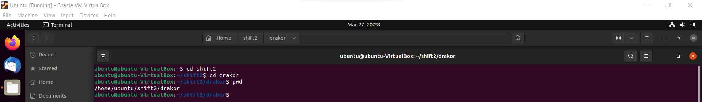
Kemudian, setelah membuat folder, file zip tersebut akan diextract. Berikut adalah kode yang kami gunakan untuk melakukan extract file zip.
```c
void unzip() {
    int status;
    pid_t child_id;
    child_id = fork();
    if (child_id == 0) {
        char *argv[] = {"unzip", "drakor.zip", "*.png", "-d", "/home/ubuntu/shift2/drakor", NULL};
        execv("/usr/bin/unzip", argv);
    } else {
        ((wait(&status)) > 0);
    }
}
```
Pada kode di atas, kami hanya akan mengekstrak file-file yang berformat `.png` yang merupakan file penting menurut soal dengan menambahkan option `"*.png"` dan mengekstraknya ke folder yang telah dibuat tadi.
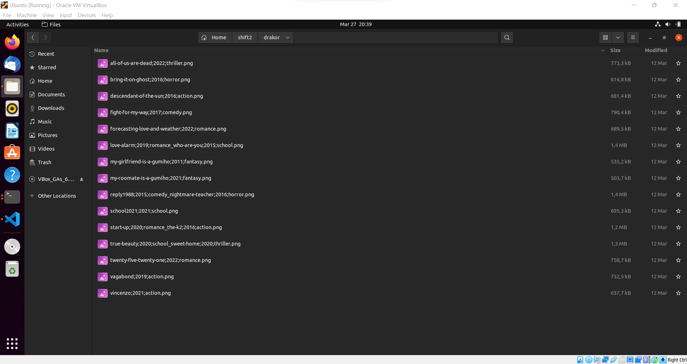

### # B
Poster drama korea perlu dikategorikan sesuai jenisnya, maka program harus membuat folder untuk setiap jenis drama korea yang ada dalam zip. Karena kamu tidak mungkin memeriksa satu-persatu manual, maka program harus membuatkan folder-folder yang dibutuhkan sesuai dengan isi zip.
Contoh: Jenis drama korea romance akan disimpan dalam “/drakor/romance”, jenis drama korea action akan disimpan dalam “/drakor/action” , dan seterusnya.

**Penyelesaian B**

Pada soal B ini, kita akan diberikan tugas untuk membuat folder sesuai genre yang ada pada file-file poster drakor yang sudah diekstrak tadi. Namun, sebelum itu, kami akan melakukan satu fase yang penting untuk selanjutnya, yaitu pemrosesan file. Algoritma yang kami gunakan adalah membagi-bagi tiap nama file dan memasukan bagian-bagian nama file itu ke dalam suatu array yang berbeda sesuai jenis data yang didapat, tidak lupa juga untuk nama file asli secara keseluruhan juga kami simpan di suatu array terpisah agar memudahkan kami untuk mencarinya nanti. Contoh, untuk file dengan nama `vincenzo;2021;action.png` nanti setiap bagian akan dimasukan ke masing-masing array, seperti `title[n] = vincenzo`, `year[n] = 2021`, `genre = action.png`, dan `titleori[n] = vincenzo;2021;action.png`. Berikut adalah kode dari algoritma tersebut.
```c
void checkFiles(char *basePath) {
    char path[1000], title[50][100], year[50][100], genre[50][100], titleori[50][100];
    struct dirent *dp;
    DIR *dir = opendir(basePath);
    char *token;

    if (!dir) {
        return;
    }

    int data = 0;
    while ((dp = readdir(dir)) != NULL) {
        if (strcmp(dp->d_name, ".") != 0 && strcmp(dp->d_name, "..") != 0) {
            char temp[100], file[2][100];
            char *token;
            strcpy(titleori[data], dp->d_name);
            int flag = 0;
            if (!(strstr(dp->d_name, "_"))) { //ini untuk file yang 1 poster 1 judul
                strcpy(temp, dp->d_name);
                token = strtok(temp, ";");
                strcpy(title[data], token);
                flag++;
                while (flag < 3) {
                    token = strtok(NULL, ";");
                    if (strstr(token, "20")) {
                        strcpy(year[data], token);
                        // printf("%s\n", year[data]);
                    } else if (strstr(token, ".png")) {
                        strcpy(genre[data], token);
                        // printf("%s\n", genre[data]);
                    }
                    flag++;
                }
            } else if (strstr(dp->d_name, "_")) { //ini untuk file yg 2 judul 1 poster
                strcpy(temp, dp->d_name);
                token = strtok(temp, "_");
                strcpy(file[0], token);
                token = strtok(NULL, "_");
                strcpy(file[1], token);
                // printf("%s\n", file[0]);
                // printf("%s\n", file[1]);
                for (int i = 0; i < 2; i++) {
                    strcpy(temp, file[i]);
                    token = strtok(temp, ";");
                    strcpy(title[data], token);
                    // printf("%s\n", title[data]);
                    flag++;
                    while (flag < 3) {
                        token = strtok(NULL, ";");
                        if (strstr(token, "20")) {
                            strcpy(year[data], token);
                            // printf("%s\n", year[data]);
                        } else if (flag == 2) {
                            strcpy(genre[data], token);
                            // printf("%s\n", genre[data]);
                        }
                        flag++;
                    }
                    // printf("%s\n", title[i]);
                    flag = 0;
                    data++;
                }
            }
        }
        data++;
    }
    // ... lanjutan fungsi void checkFiles di sini
```
Setelah semua file terbaca dan data-datanya dimasukan ke dalam array, kita akan memasukan file-file tersebut ke dalam folder sesuai genrenya. Sebelum memasukan semua poster ke dalam foldernya masing-masing, jangan lupa untuk menghapus substring `.png` yang masih ada di beberapa elemen pada array `genre`. Setelah itu, kita akan membuat folder untuk masing-masing genre dengan menggunakan array dari genre yang sudah didapat tadi. Berikut adalah kodenya.
```c
    // ... lanjutan fungsi void checkFiles di sini
    for (int i = 0; i < 25; i++) {
        char *token1;
        char path2[100];
        strcpy(path2, pathori);
        //menghapus substring .png pada array genre
        if (strstr(genre[i], ".png")) {
            token1 = strtok(genre[i], ".");
            strcpy(genre[i], token1);
        }

        //membuat directory sesuai genre
        // printf("%s\n", genre[i]);
        if (strlen(genre[i]) > 4) {
            strcat(path2, genre[i]);
            strcat(path2, "/");
            createDir(path2);
        }
        // ... lanjutan loop ini akan ada di soal no 2 c
```
Pada kode di atas, bagian yang untuk membuat directory genre, kami menggunakan `if (strlen(genre[i]) > 4)` karena pada array terdapat elemen dengan bahasa yang sedikit aneh dan bukan merupakan suatu genre serta panjangnya tidak lebih dari 4 karakter sehingga kami menggunakan itu agar mendapatkan elemen genre yang benar-benar merupakan genre asli dari poster. Berikut adalah hasilnya.
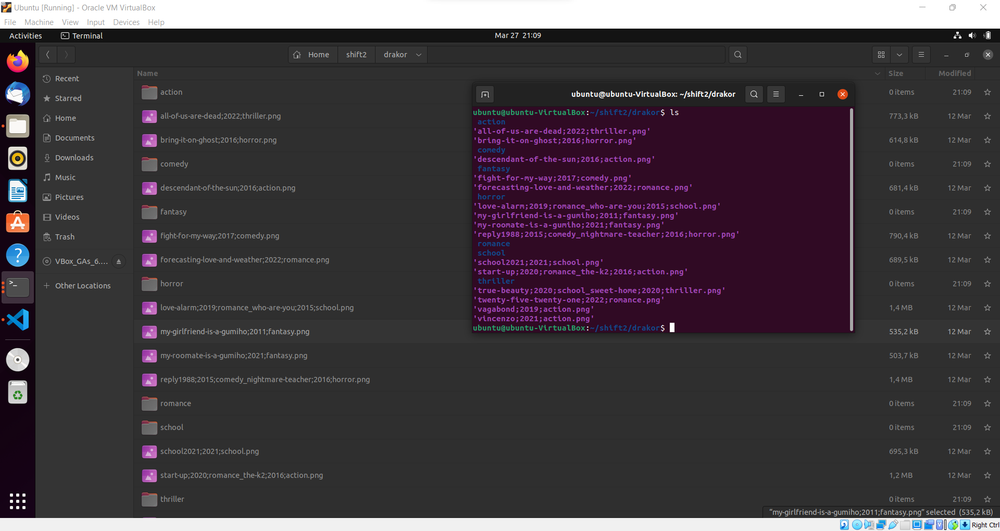

### # C
Setelah folder kategori berhasil dibuat, program akan memindahkan poster ke folder dengan kategori yang sesuai dan di rename dengan nama.
Contoh: “/drakor/romance/start-up.png”.

**Penyelesaian C**

Pada soal C ini, kita diberikan tugas untuk memasukan file-file ke dalam folder sesuai genrenya dan merename nama file poster tersebut menjadi `judul.png`. Algoritmanya di sini adalah kami mencari tahu apakah ada substring `title` atau judul pada nama file asli yang ada di home folder drakor. Kemudian, kami membuat path dari source file `src` dan destination file `dest` lalu melakukan copy. Berikut adalah kodenya.
```c
        // ... lanjutan soal 2 b
        //Revisi soal 2 - untuk masukin semua file ke dalam folder genre masing-masing
        //awalnya cuma bisa memindahkan file yang 1 judul 1 poster saja, saat ini sudah bisa memasukan semua jenis file
        for (int j = 0; j < 25; j++) {
            if (strstr(titleori[j], title[i])) {
                char src[100], dest[100];
                strcpy(src, pathori);
                strcpy(dest, pathori);
                strcat(src, titleori[j]);
                strcat(dest, genre[i]);
                strcat(dest, "/");
                strcat(dest, title[i]);
                strcat(dest, ".png");
                // printf("%s\n", dest);
                copyFiles(src, dest);
            }
        }
    }
    // ... lanjutan kode fungsi checkFiles di sini
```
Berikut ini adalah kode dari fungsi `copyFiles` yang berfungsi untuk melakukan copy ke dalam folder sesuai genre.
```c
void copyFiles(char *src, char *dest) {
    int status;
	pid_t child_id;
    child_id = fork();
	if (child_id == 0) {
		char *argv[] = {"cp", "-n", src, dest, NULL};
		execv("/usr/bin/cp", argv);
	} else {
		((wait(&status)) > 0);
	}
}
```
Pada kode di atas, kami melakukan setting tidak akan ada overwrite file dengan option `-n`.
Berikut adalah hasilnya.
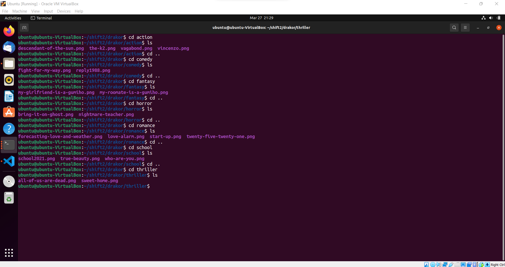

### # D
Karena dalam satu foto bisa terdapat lebih dari satu poster maka foto harus di pindah ke masing-masing kategori yang sesuai. Contoh: foto dengan nama “start-up;2020;romance_the-k2;2016;action.png” dipindah ke folder “/drakor/romance/start-up.png” dan “/drakor/action/the-k2.png”. (note 19/03: jika dalam satu foto ada lebih dari satu poster maka foto tersebut dicopy jadi akhirnya akan jadi 2 foto)

**Penyelesaian D**

Penyelesaian untuk bagian D sama seperti bagian C

### # E
Di setiap folder kategori drama korea buatlah sebuah file "data.txt" yang berisi nama dan tahun rilis semua drama korea dalam folder tersebut, jangan lupa untuk sorting list serial di file ini berdasarkan tahun rilis (Ascending)

**Penyelesaian E**

REVISI
Pada soal bagian E ini, kita diberikan tugas untuk membuat file `data.txt` yang nantinya berisi kategori, judul drakor, dan tahun rilisnya yang disorting secara ascending. Sebelum membuat file `data.txt` kami terlebih dahulu melakukan sorting array yang telah kami buat sebelumnya, yaitu `title`, `year`, dan `genre`. Berikut adalah kode sorting yang kami gunakan.
```c
    // ... lanjutan kode fungsi checkFiles di sini
    // sorting all array
    char temptitle[100];
    char tempyear[100];
    char tempgenre[100];
    for (int i = 0; i < 25; i++) {
        for (int j = 0; j < 25 - 1 - i; j++) {
            if (strcmp(year[j], year[j+1]) > 0) {
                strcpy(temptitle, title[j]);
                strcpy(tempgenre, genre[j]);
                strcpy(tempyear, year[j]);
                strcpy(title[j], title[j+1]);
                strcpy(genre[j], genre[j+1]);
                strcpy(year[j], year[j+1]);
                strcpy(title[j+1], temptitle);
                strcpy(genre[j+1], tempgenre);
                strcpy(year[j+1], tempyear);
            }
        }
    }
    // ... lanjutan kode fungsi checkFiles di sini
```
Setelah melakukan sorting, selanjutnya kami akan membuat file `data.txt` pada setiap folder genre yang ada. Berikut adalah kodenya.
```c
    //Revisi Soal 2 - bagian e membuat file txt
    FILE *fptr1;
    int flagf = 0;
    char fname1[100];
    char temp[100];
    strcpy(temp, genre[0]);
    for (int i = 0; i < 8; i++) {
        char ttemp[10][50];
        int tyear[10];
        strcpy(fname1, pathori);
        strcat(fname1, "/");
        strcat(fname1, temp);
        strcat(fname1, "/");
        strcat(fname1, "data.txt");
        fptr1 = fopen(fname1, "a+");
        fprintf(fptr1, "kategori : %s", temp);
        for (int j = 0; j < 25; j++) {
            if (strcmp(genre[j], temp) == 0) {
                fprintf(fptr1, "\n\nnama : %s\n",title[j]);
                fprintf(fptr1, "rilis : tahun %s", year[j]);
                strcpy(genre[j], "do");
            }
        }
        int flag = 0;
        while (flag < 25) {
            if (strlen(genre[flag]) > 3) {
                strcpy(temp, genre[flag]);
            }
            flag++;
        }
    }
```
Algoritma dari kode di atas adalah pertama kami memasukan genre pertama ke dalam `temp`, kemudian membuat path dari file `data.txt`, kemudian memasukan data-data ke dalam file `data.txt`, setelah itu akan mencari dan melanjutkan ke genre selanjutnya.
Berikut adalah hasil dari setiap file `data.txt`.
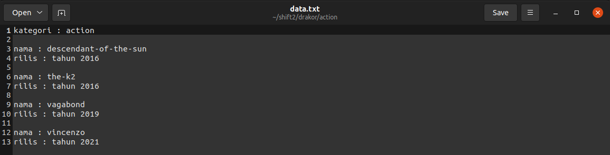
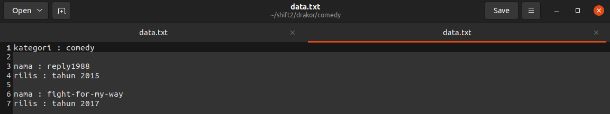
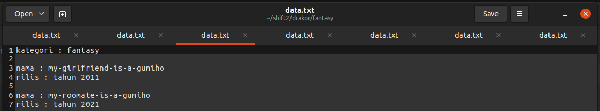
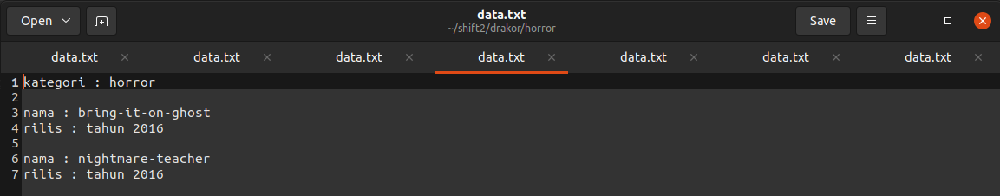
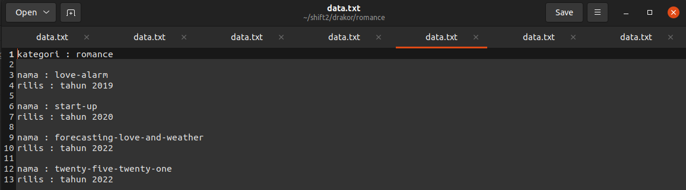
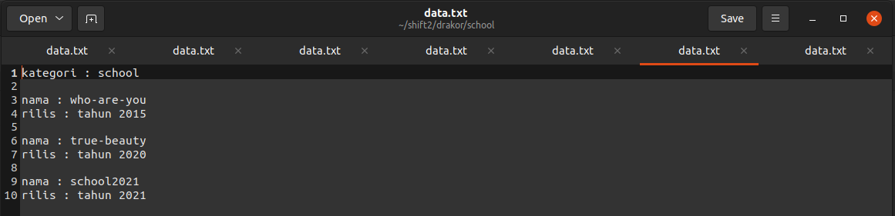
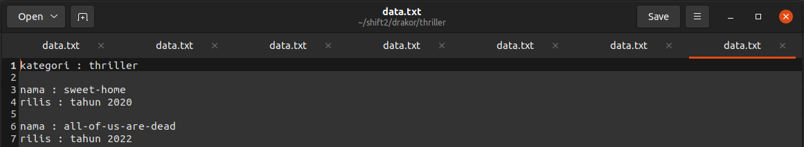

Setelah semua proses selesai, tidak lupa juga kami menghapus file-file poster yang tadi diekstrak dan sudah selesai digunakan. Berikut adalah kode yang kami gunakan untuk melakukan delete file.
```c
// Revisi soal 2 - untuk delete file
    for (int j = 0; j < 25; j++) {
        char file[100];
        strcpy(file, pathori);
        strcat(file, titleori[j]);
        deleteFile(file);
    }
    
    // hapus file data.txt yg ada di home directory
    char file5[100];
    strcpy(file5, pathori);
    strcat(file5, "data.txt");
    deleteFile(file5);

    closedir(dir);
}
// .. akhir dari fungsi checkFiles

void deleteFile(char *namaFile) {
    int status;
    pid_t child_id;
    child_id = fork();
    if (child_id == 0) {
        char *argv[] = {"rm", namaFile, NULL};
        execv("/bin/rm", argv);
    } else {
        ((wait(&status)) > 0);
    }
}
```
Pada kode di atas, kami menambahkan delete file `data.txt` yang entah bagaimana tergenerate pada folder home directory drakor.
Berikut adalah hasil dari fungsi delete.
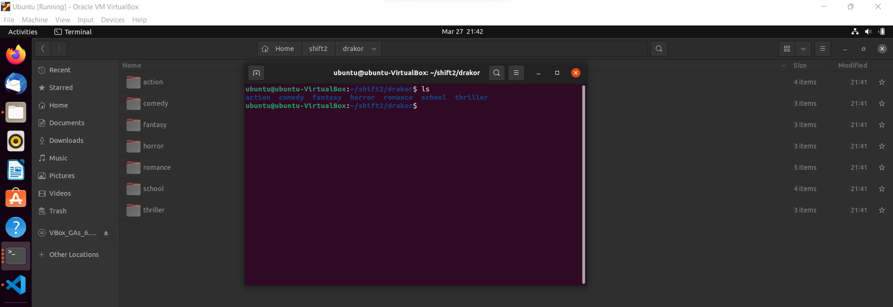

Berikut adalah hasil screenshot jika program soal 2 dijalankan pada terminal.
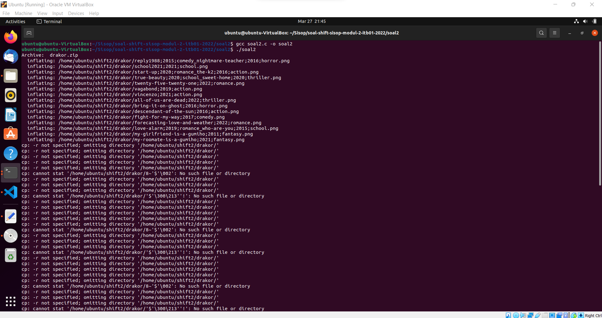

### # Kendala
Kendala dalam pengerjaan soal ini secara umu ada beberapa
* Sering terjadi segmentation fault yang sebagian besar disebabkan karena masih adanya file hasil pemrosesan data sebelumnya dan juga pada loop
* Masih kurangnya pemahaman pada file handling pada bahasa C
---

## Soal 3

Oleh Fatchia Farhan

### Narasi Soal
Narasi Soal

Conan adalah seorang detektif terkenal. Suatu hari, Conan menerima beberapa laporan tentang hewan di kebun binatang yang tiba-tiba hilang. Karena jenis-jenis hewan yang hilang banyak, maka perlu melakukan klasifikasi hewan apa saja yang hilang.

Pada soal no 3 kita diminta untuk membuat program c dengan ketentuan sebagai berikut:
* Membuat 2 direktori di “/home/[USER]/modul2/” dengan nama darat dan air. Jarak pembuatan antara darat dan air adalah 3 detik.
* Mengekstrak animal.zip di “home/[USER]/modul2/”.
* Memisahkan hasil ekstrak menjadi 2 bagian yaitu darat dan air sesuai dengan nama filenya.
* Hewan darat dimasukkan ke folder “/home/[USER]/modul2/darat” dan hewan air ke folder “/home/[USER]/modul2/air”. Rentang pembuatan folder adalah 3 detik. 
* Hewan tanpa keterangan darat atau air harus dihapus.
* Menghapus semua file dengan nama “bird” yang ada di direktori “/home/[USER]/modul2/darat” 
* Membuat file list.txt di folder  “/home/[USER]/modul2/air” dan me-list kan nama hewan di direktori tersebut ke list.txt dengan format UID_[UID file permission]_Nama File.[jpg/png].


### # A
Soal A

Untuk mempercepat klasifikasi, Conan diminta membuat program untuk membuat 2 directory di “/home/[USER]/modul2/” dengan nama “darat” lalu 3 detik kemudian membuat directory ke 2 dengan nama “air”.

**Penyelesaian A**

Penyelesaian A

Pertama dibuat fungsi `int main` sebagai berikut:
```c
int main() {
    pid_t childID;
    int status;

childID = fork();

    if (childID < 0) {
            exit(EXIT_FAILURE); 
    }
```
Fungsi tersebut digunakan untuk menduplikasikan proses yang sudah ada.

Kemudian untuk membuat direktori baru, disini digunakan if else sebagai berikut:
```c
if (childID == 0) { // child
    		char *argv[] = {"mkdir", "-p", "modul2/darat/", NULL};
    		execv("/bin/mkdir", argv);
            sleep(3);
  	} 
  
  	else { // parent
    		while ((wait(&status)) > 0);
    		char *argv[] = {"mkdir", "-p", "modul2/air/", NULL};
   		execv("/usr/bin/mkdir", argv);
  	}
}

```
Karena di-instruksikan untuk memberi jeda antara pembuatan direktori darat dan air selama 3 detik, maka diberi tambahan `sleep(3)`.

### # B
Soal B

**Penyelesaian B**

Penyelesaian B

### # C
Soal C

**Penyelesaian C**

Penyelesaian C

### # D
Soal D

**Penyelesaian D**

Penyelesaian D

### # E
Soal E

**Penyelesaian E**

Penyelesaian E
