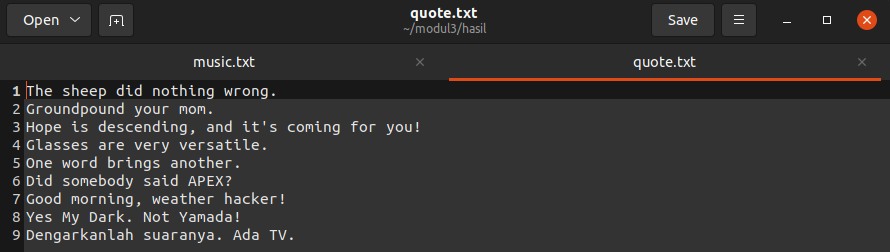
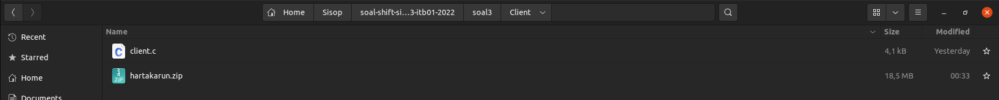
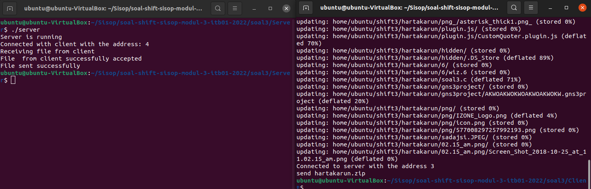

# soal-shift-sisop-modul-3-ITB01-2022

# Kelompok ITB01 Sistem Operasi B

- I Putu Windy Arya Sagita 5027201071
- Fatchia Farhan 5027201044
- Surya Zandra Anggoro 5027201018

# Soal

Link soal : [Soal Shift 3](https://docs.google.com/document/d/1w3tYGgqIkHRFoqKJ9nKzwGLCbt30HM7S/edit)

---

# Daftar Isi
* [Soal 1](#user-content-soal-1)
* [Soal 2](#user-content-soal-2)
* [Soal 3](#user-content-soal-3)

## Soal 1

Oleh - I Putu Windy Arya Sagita (Kode) & Surya Zandra Anggoro (Laporan)

### Narasi Soal
Novak adalah seorang mahasiswa biasa yang terlalu sering berselancar di internet. Pada suatu saat, Ia menemukan sebuah informasi bahwa ada suatu situs yang tidak memiliki pengguna. Ia mendownload berbagai informasi yang ada dari situs tersebut dan menemukan sebuah file dengan tulisan yang tidak jelas. Setelah diperhatikan lagi, kode tersebut berformat base64. Ia lalu meminta kepada anda untuk membuat program untuk memecahkan kode-kode di dalam file yang Ia simpan di drive dengan cara decoding dengan base 64. Agar lebih cepat, Ia sarankan untuk menggunakan thread.

### # A
Download dua file zip dan unzip file zip tersebut di dua folder yang berbeda dengan nama quote untuk file zip quote.zip dan music untuk file zip music.zip. Unzip ini dilakukan dengan bersamaan menggunakan thread.

**Penyelesaian A**

Pada soal ini kita diminta untuk mendownload 2 file zip yang telah di sediakan pada gdrive yang telah di buat lalu kita di suruh untuk melakukan unzip pada kedua file. Pertama-tama kita akan melakukan download kedua file zip terlebih dahulu. Untuk melakukan download file kami menggunakan command `wget`. Berikut adalah kodenya.
```c 
void downloadQuote() {
    int status;
    pid_t child_id;
    child_id = fork();
    if (child_id == 0) {
        char *argv[] = {"wget", "--no-check-certificate", "https://drive.google.com/uc?id=1jR67_JAyozZPs2oYtYqEZxeBLrs-k3dt&export=download", "-O", "quote.zip", NULL};
        execv("/bin/wget", argv);
    } else {
        ((wait(&status)) > 0);
    }
}

void downloadMusic() {
    int status;
    pid_t child_id;
    child_id = fork();
    if (child_id == 0) {
        char *argv[] = {"wget", "--no-check-certificate", "https://drive.google.com/uc?id=1_djk0z-cx8bgISFsMiUaXzty2cT4VZp1&export=download", "-O", "music.zip", NULL};
        execv("/bin/wget", argv);
    } else {
        ((wait(&status)) > 0);
    }
} 
```
Pada kode di atas, kami pertama-tama memindahkan current working directory ke directory `path` dengan command `chdir` sehingga nanti hasil downloadnya akan masuk ke directory tersebut. Kemudian dengan menggunakan `wget`, kami akan melakukan download file zip. Pada command `wget` terlihat kami menggunakan `--no-check-certificate` agar ketika program mencoba mendownload tidak perlu mengecek certificate website terlebih dahulu dan dapat langsung mendownload bahkan ketika certificate website tidak sesuai. Kemudian, kami menggunakan option `-O` juga untuk menspesifikasikan nama output/hasil downloadnya nanti.
hasilnya


Setelah mendownload kedua file zip tersebut, selanjutnya kami akan melakukan unzip kedua file tersebut secara bersamaan dengan menggunakan thread. Berikut adalah kode yang kami gunakan.
```c 
void *processUnzip(void *tipe) {
    int status;
    pid_t child_id;
    child_id = fork();
    if (child_id == 0) {
        char *argv[] = {"unzip", "music.zip", "-d", pathm, NULL};
        execv("/usr/bin/unzip", argv);
    } else {
        ((wait(&status)) > 0);
    }

    child_id = fork();
    if (child_id == 0) {
        char *argv[] = {"unzip", "quote.zip", "-d", pathq, NULL};
        execv("/usr/bin/unzip", argv);
    } else {
        ((wait(&status)) > 0);
    }

}
```
Kemudian, untuk threadnya kami taruh pada main program. Berikut adalah potongan kodenya.
```c
int main() {
    ...
    strcpy(pathm, path);
    strcat(pathm, "music");
    makeDir(pathm);

    strcpy(pathq, path);
    strcat(pathq, "quote");
    makeDir(pathq);

    pthread_t tid;
    pthread_create(&(tid), NULL, processUnzip, NULL);
    pthread_join(tid, NULL);
    ...
```
Pada potongan kode main program, kami pertama-tama membuat folder music dan quote terlebih dahulu dan path dari masing-masing folder kami simpan ke dalam global variabel `pathm` untuk music dan `pathq` untuk quote agar nantinya dapat dengan mudah digunakan pada fungsi-fungsi lainnya. Setelah membuat folder tersebut, kami akan melakukan proses unzip dengan thread dena akan masuk ke fungsi `processUnzip`. Pada fungsi `processUnzip` tidak lupa kami ubah current working directory terlebih dahulu, kemudian dengan `fork()` dan `execv` kami akan memanggil command `unzip` dengan option `-d` untuk menspesifikkan folder tujuan dari unzip ini.
Berikut adalah hasil unzip dari file zip music

Berikut adalah hasil unzip dari file zip quote


### # B
Decode semua file .txt yang ada dengan base 64 dan masukkan hasilnya dalam satu file .txt yang baru untuk masing-masing folder (Hasilnya nanti ada dua file .txt) pada saat yang sama dengan menggunakan thread dan dengan nama quote.txt dan music.txt. Masing-masing kalimat dipisahkan dengan newline/enter.

**Penyelesaian B**

Pada soal kedua ini kita diminta untuk medecode semua file yang telah didownload tadi menggunakan base64 dan setelahnya kita diminta untuk membuat file.txt baru untuk hasil dari decode yang telah dilakukan.
Untuk menyelesaikan soal poin B ini, kami menggunakan kode berikut ini.
```c
void processText() {
    char textType[2][10] = {"music", "quote"};

    struct dirent *dp;
    DIR *dir;

    for (int i = 0; i < 2; i++) {
        char patht[100];
        if (strcmp(textType[i], "music") == 0) {
            strcpy(patht, pathm);
        } else {
            strcpy(patht, pathq);
        }

        dir = opendir(patht);
        if (!dir) {
            break;
        }

        int data = 0;
        while ((dp = readdir(dir)) != NULL) {
            if (strcmp(dp->d_name, ".") != 0 && strcmp(dp->d_name, "..") != 0) {
                char temp[100];
                char *temp1;
                char *temp2;
                size_t declen;
                strcpy(temp, patht);
                strcat(temp, "/");
                strcat(temp, dp->d_name);
                FILE *fptr;
                fptr = fopen(temp, "a+");
                if (strcmp(textType[i], "music") == 0) {
                    fscanf(fptr, "%s", encodedm[data]);
                    temp1 = encodedm[data];
                    declen = b64_decoded_size(temp1);
                    temp2 = malloc(declen);
                    b64_decode(temp1, (unsigned char *)temp2, declen);
                    temp2[declen] = '\0';
                    strcpy(decodedm[data], temp2);
                    free (temp2);
                } else {
                    fscanf(fptr, "%s", encodedq[data]);
                    temp1 = encodedq[data];
                    declen = b64_decoded_size(temp1);
                    temp2 = malloc(declen);
                    b64_decode(temp1, (unsigned char *)temp2, declen);
                    temp2[declen] = '\0';
                    strcpy(decodedq[data], temp2);
                    free (temp2);
                }
                fclose(fptr);
            }
            data++;
        }
        closedir(dir);
    }

    char pathh[100];
    strcpy(pathh, path);
    strcat(pathh, "hasil");
    makeDir(pathh);

    pthread_t tid;
    pthread_create(&(tid), NULL, moveText, (char *)pathh);
    pthread_join(tid, NULL);
}
```
Pada kode di atas kami pertama-tama membaca string yang ada pada masing-masing file `txt` music atau quote dan memasukan hasil read tersebut ke array `encodedm` untuk music atau `encodedq` untuk quote dengan kode ini `fscanf`. Kemudian, array tersebut kami masukan lagi ke pointer char `temp1` untuk nantinya akan didecode dengan base 64. Setelah itu, hasil decoding kemudian akan dimasukan ke array `decodedm` untuk music atau `decodedq` untuk quote. Proses tersebut akan dilakukan secara terus menerus hingga semua file `txt` untuk masing-masing folder terbaca. Sedikit catatan, jangan lupa untuk selalu melakukan `fclose` atau `closedir` setelah pembacaan file atau folder agar tidak terjadi looping berulang yang tidak diinginkan atau segmentation fualt. Setelah semua file terbaca dan terdecode, kami akan membuat folder hasil dan kemudian dengan thread kami akan memasukan hasil decode tadi ke dalam satu file `music.txt` dan `quote.txt` sesuai permintaan soal dengan fungsi yang bernama `moveText`.

Berikut adalah kode untuk fungsi `moveText`.
```c
void *moveText(void *pathl) {
    char pathh[100];
    char textType[2][10] = {"music", "quote"};
    strcpy(pathh, pathl);
    
    for (int i = 0; i < 2; i++) {
        char temp[100];
        strcpy(temp, pathh);
        if (strcmp(textType[i], "music") == 0) {
            strcat(temp, "/");
            strcat(temp, "music.txt");
        } else {
            strcat(temp, "/");
            strcat(temp, "quote.txt");
        }

        FILE *fptr;
        fptr = fopen(temp, "a+");
        if (strcmp(textType[i], "music") == 0) {
            for (int j = 0; j < 11; j++) {
                if (strlen(decodedm[j]) > 3) {
                    fprintf(fptr, "%s\n", decodedm[j]);
                }
            }
        } else {
            for (int j = 0; j < 11; j++) {
                if (strlen(decodedq[j]) > 3) {
                    fprintf(fptr, "%s\n", decodedq[j]);
                }
            }
        }
        fclose(fptr);
    }
}
```
Pada kode di atas, kami pertama-tama membuat path terlebih dahulu untuk masuk ke directory music atau quote. Setelah itu, dengan file pointer, file akan dibuka denga permission `a+` yang berguna untuk melakukan open file dan melakukan appending atau penambahan pada file tersebut. Setelah itu, hasil decode yang ada pada array `decodedm` atau `decodedq` akan dimasukan ke file `txt` sesuai dengan asalnya dengan perintah `fprintf`. Proses memasukan hasil decode tersebut akan terus berlanjut hingga hasil kedua array decode berhasil dimasukkan. 

**Notes**
Sebelumnya, dalam melakukan decoding kami menggunakan kode berikut.
```c
const char b64chars[] = "ABCDEFGHIJKLMNOPQRSTUVWXYZabcdefghijklmnopqrstuvwxyz0123456789+/";
int b64invs[] = {62, -1, -1, -1, 63, 52, 53, 54, 55, 56, 57, 58, 59, 60, 61, -1, -1, -1, -1, -1, -1, -1, 0, 1, 2, 3, 4, 5, 6, 7, 8, 9, 10, 11, 12, 13, 14, 15, 16, 17, 18, 19, 20, 21, 22, 23, 24, 25, -1, -1, -1, -1, -1, -1, 26, 27, 28, 29, 30, 31, 32, 33, 34, 35, 36, 37, 38, 39, 40, 41, 42, 43, 44, 45, 46, 47, 48, 49, 50, 51 };
size_t b64_decoded_size(const char *encd) {
    size_t len, res, i;

    if (encd == NULL) {
        return 0;
    }

    len = strlen(encd);
    res = len / 4 * 3;

    for (i = len; i-->0; ) {
        if (encd[i] == '=') {
            res--;
        } else {
            break;
        }
    }

    return res;
}

void b64_decodetable() {
    int inv[80];
    size_t i;

    memset(inv, -1, sizeof inv);
    for (i = 0; i < sizeof(b64chars) - 1; i++) {
        inv[b64chars[i] - 43] = i;
    }
}

int b64_validchar(char x) {
    int flag = 0;

    if (x >= '0' && x <= '9') {
        flag = 1;
    } else if (x >= 'A' && x <= 'Z') {
        flag = 1;
    } else if (x >= 'a' && x <= 'z') {
        flag = 1;
    } else if (x == '+' || x == '/' || x == '=') {
        flag = 1;
    }

    return flag;
}

void b64_decode(const char *encd, unsigned char *decd, size_t decdlen) {
    size_t len, i, j;
    int v;

    if (encd == NULL || decd == NULL) {
        return;
    }

    len = strlen(encd);
    if (decdlen < b64_decoded_size(encd) || len % 4 != 0) {
        return;
    }

    for (i = 0; i < len; i++) {
        if (b64_validchar(encd[i]) == 0) {
            return;
        }
    }

    for (i=0, j=0; i<len; i+=4, j+=3) {
		v = b64invs[encd[i]-43];
		v = (v << 6) | b64invs[encd[i+1]-43];
		v = encd[i+2]=='=' ? v << 6 : (v << 6) | b64invs[encd[i+2]-43];
		v = encd[i+3]=='=' ? v << 6 : (v << 6) | b64invs[encd[i+3]-43];

		decd[j] = (v >> 16) & 0xFF;
		if (encd[i+2] != '=')
			decd[j+1] = (v >> 8) & 0xFF;
		if (encd[i+3] != '=')
			decd[j+2] = v & 0xFF;
	}
}
```
Berikut adalah hasil dari soal poin B ini.
Screenshot folder modul

Screenshot folder hasil

Screenshot file music.txt

Screenshot file quote.txt


### # C
Pindahkan kedua file .txt yang berisi hasil decoding ke folder yang baru bernama hasil.

**Penyelesaian C**
Soal poin C ini secara langsung terjawab dengan kode yang ada pada poin B, dimana kami secara langsung membuat file `music.txt` dan `quote.txt` pada folder hasil. Potongan kodenya adalah sebagai berikut.
```c
void processText() {
    ...
    char pathh[100];
    strcpy(pathh, path);
    strcat(pathh, "hasil");
    makeDir(pathh);
    ...
}

void *moveText(void *pathl) {
    char pathh[100];
    char textType[2][10] = {"music", "quote"};
    strcpy(pathh, pathl);
    
    for (int i = 0; i < 2; i++) {
        char temp[100];
        strcpy(temp, pathh);
        if (strcmp(textType[i], "music") == 0) {
            strcat(temp, "/");
            strcat(temp, "music.txt");
        } else {
            strcat(temp, "/");
            strcat(temp, "quote.txt");
        }
    ...
}
```
Berikut adalah screenshot pada folder hasil.


### # D
Folder hasil di-zip menjadi file hasil.zip dengan password 'mihinomenest[Nama user]'. (contoh password : mihinomenestnovak)

**Penyelesaian D**

Pada soal ini, folder hasil tadi akan dizip dengan password sesuai dengan soal. Berikut adalah kode yang kami gunakan.
```c
char pass[] = "mihinomenestwindy";
void zip() {
    chdir(path);
    int status;
    pid_t child_id;
    child_id = fork();
    if (child_id == 0) {
        char *argv[] = {"zip", "-qrP", pass, "hasil.zip", "hasil", NULL};
        execv("/usr/bin/zip", argv);
    } else {
        ((wait(&status)) > 0);
    }
}
```
Pada kode di atas, kami melakukan zipping file dengan beberapa option, seperti `-q` agar proses zip dilakukan secara quiet operation, kemudian `-r` agar proses zip dilakukan secara rekursif mengingat yang akan dizip adalah sebuah folder dengan isinya, dan terakhir ada opsi `-P` untuk memberikan password pada file zip.
Berikut adalah hasil file zipnya.

Berikut adalah file zip jika ingin diextract


### # E
Karena ada yang kurang, kalian diminta untuk unzip file hasil.zip dan buat file no.txt dengan tulisan 'No' pada saat yang bersamaan, lalu zip kedua file hasil dan file no.txt menjadi hasil.zip, dengan password yang sama seperti sebelumnya.

**Penyelesaian E**

Pada soal poin E ini, kita diminta untuk melakukan unzip file hasil tadi dan memasukan file txt dengan nama `no.txt` dan berisi tulisan 'No'. Berikut adalah kode yang kami gunakan.
```c
void *forgetNo(void *arg) {
    chdir(path);
    int status;
    pid_t child_id;
    child_id = fork();
    if (child_id == 0) {
        char *argv[] = {"unzip", "-qo", "-P", pass, "hasil.zip", NULL};
        execv("/usr/bin/unzip", argv);
    } else {
        ((wait(&status)) > 0);
    }

    char ptemp[100];
    strcpy(ptemp, path);
    strcat(ptemp, "hasil/no.txt");
    FILE *fptr;
    fptr = fopen(ptemp, "a+");
    fprintf(fptr, "No");
    fclose(fptr);

    zip();
}
```
Pada kode di atas, kami pertama-tama melakukan change current working directory untuk memastikan bahwa saat ini kita sedang bekerja di directory modul. Setelah itu, kami lakukan unzip dengan option `q` untuk quiet operation, `-o` agar nanti melakukan overwritten karena folder hasil sebenarnya sudah ada, dan `-P` untuk memasukan password yang digunakan dalam unzip. Kemudian, kami membuat file `no.txt` dan membuka file tersebut dan memasukan tulisan 'No` ke dalamnya dengan `fprintf`. Terakhir tidak lupa juga kami melakukan unzip dengan ketiga file txt tersebut menggunakan fungsi zip yang ada pada soal poin D.
Berikut adalah hasilnya.
Screenshot folder hasil

Screenshot file no.txt

Screenshot folder modul

Screenshot file zip hasil


### # Kendala
Kendala pengerjaan soal 1
* Tidak ada kendala berarti dalam pengerjaan no 1, sempat terjadi segmentation fault dan looping berulang yang tidak diinginkan karena lupa melakukan `fclose` atau `closedir`.

---

## Soal 2

Oleh - Fatchia Farhan

### Narasi Soal
Bluemary adalah seorang Top Global 1 di salah satu platform online judge. Suatu hari Ia ingin membuat online judge nya sendiri, namun dikarenakan Ia sibuk untuk mempertahankan top global nya, maka Ia meminta kamu untuk membantunya dalam membuat online judge sederhana. Online judge sederhana akan dibuat dengan sistem client-server dengan beberapa kriteria sebagai berikut:

### # A
Pada saat client terhubung ke server, terdapat dua pilihan pertama yaitu register dan login. Jika memilih register, client akan diminta input id dan passwordnya untuk dikirimkan ke server. Data input akan disimpan ke file **users.txt** dengan format **username:password**. Jika client memilih login, server juga akan meminta client untuk input id dan passwordnya lalu server akan mencari data di **users.txt** yang sesuai dengan input client. Jika data yang sesuai ditemukan, maka client dapat login dan dapat menggunakan command-command yang ada pada sistem. Jika tidak maka server akan menolak login client. Username dan password memiliki kriteria sebagai berikut:
* Username unique (tidak boleh ada user yang memiliki username yang sama)
* Password minimal terdiri dari 6 huruf, terdapat angka, terdapat huruf besar dan kecil

**Penyelesaian A**

Library yang digunakan adalah sebagai berikut:
```c
#include <stdio.h>
#include <sys/socket.h>
#include <stdlib.h>
#include <netinet/in.h>
#include <string.h>
#include <unistd.h>
#include <pthread.h>
#include <ctype.h>
#include <sys/types.h>
#include <sys/stat.h>
#include <errno.h>
#include <dirent.h>
#include <time.h>

#define PORT 8080
#define MAX_LENGTH 1024
```
untuk server.c, sedangkan untuk client.c adalah sebagai berikut:
```c
#include <stdio.h>
#include <sys/socket.h>
#include <stdlib.h>
#include <netinet/in.h>
#include <string.h>
#include <unistd.h>
#include <arpa/inet.h>
#include <pthread.h>
#include <errno.h>
#include <dirent.h>
#include <ctype.h>

#define MAX_LENGTH 1024
#define PORT 8080
```

Pada bagian server.c dan client.c terdapat `struct user_t` untuk menyimpan data-data user. 
Pada server.c adalah sebagai berikut:
```c
struct user_t {
    char name[1000];
    char pwd[1000];
    char file[1000];
    char mode[1000];
    int is_auth;
    int socket;
} user;
```
Sedangkan pada client.c adalah sebagai berikut:
```c
struct user_t {
    int is_auth;
    int socket;
    char file[1000];
    char input[1000];
    char mode[1000];
} user;
```

Selanjutnya terdapat fungsi `message` di server.c untuk mengirim message.
```c
void message(char input[]) {
    char buffer[1024];
    sprintf(buffer, "\n%s\n", input);
    send(user.socket, buffer, 1024, 0);
}
```

Untuk login, pada server.c terdapat function `login`:
```c
int login(char id[], char password[]) {
    FILE *fp = fopen("users.txt", "r");
    int is_auth = 0;
    char buffer[1024];
    while (fgets(buffer, 1024, fp) != NULL && is_auth == 0) {
        char file_id[1024], file_password[1024];
        char *token = strtok(buffer, ":");
        strcpy(file_id, token);
        token = strtok(NULL, "\n");
        strcpy(file_password, token);

        if (strcmp(id, file_id) == 0 && strcmp(password, file_password) == 0) {
            is_auth = 1;
        } else {
            is_auth = 0;
        }
    }
    fclose(fp);
    return is_auth;
}
```

Selanjutnya untuk mengecek password apakah sudah sesuai dengan kriteria soal atau belum dapat menggunakan fungsi `checkpass`:
```c
int checkPass(char pass[]) {
    int flaga = 0;
    int flagb = 0;
    int flagc = 0;
    if (strlen(pass) < 6) {
        return 1;
    } else {
        for (int i = 0; i < strlen(pass); i++) {
            if (isupper(pass[i])) {
                flaga++;
            } 
            if (islower(pass[i])) {
                flagb++;
            } 
            if (isdigit(pass[i])) {
                flagc++;
            }
        }
    }
    if (flaga == 0 || flagb == 0 || flagc == 0) {
        return 1;
    }
    return 0;
}
```

Kemudian untuk registrasi, pada server.c terdapat fungsi `regist`
```c
int regist(char id[], char password[]) {
    int cp;
    int flag = 0;
    FILE *fp = fopen("users.txt", "a+"); 
    if (fp == NULL) {
        printf("masuk");
        cp = checkPass(password);
        if (cp == 0) {
            fprintf(fp, "%s:%s\n", id, password);
        } else {
            flag = 2;
        }
    } else {
        char buffer[1024];
        // fgets(buffer, 1024, fp);
        // fscanf(fp, "%s", buffer);
        // printf("%s\n", buffer);
        while (fgets(buffer, 1024, fp) != NULL) {
            char file_id[1024];
            char *token = strtok(buffer, ":");
            strcpy(file_id, token);
            // printf("%s\n", file_id);

            if (strcmp(id, file_id) == 0) {
                message("Username already exist.");
                flag = 1;
                break;
            }
        }
        if (checkPass(password) == 1) {
            message("Password Invalid. Must have be at least 6 characters long, 1 lowercase, 1 uppercase, and 1 number");
            flag = 2;
        } else if (flag == 0) {
            fprintf(fp, "%s:%s\n", id, password);
        }
    }
    fclose(fp);
    return flag;
}
```

Berikutnya untuk menginputkan apakah user akan login atau register pada server.c digunakan fungsi `signin`
```c
void *signin() {
    char buffer[1024];
    while (1) {
        if (user.is_auth == 0) { 
            message("1. Login\n""2. Register\n""Choices: ");

            read(user.socket, buffer, 1024); 
            for (int i = 0; buffer[i]; i++) { 
                buffer[i] = tolower(buffer[i]);
            }
            if (strcmp(buffer, "login") == 0 || strcmp(buffer, "1") == 0) {
                char id[1024];
                char password[1024];
                message("\e[1;1H\e[2J");
                message("Id: ");
                read(user.socket, id, 1024);

                message("Password: ");
                read(user.socket, password, 1024);

                user.is_auth = login(id, password); 
                if (user.is_auth == 0) { 
                    message("\e[1;1H\e[2J");
                    message("Login failed id/password is wrong!");
                    printf("Login failed id/password is wrong!\n");
                    break;
                } else if (user.is_auth == 1) {
                    strcpy(user.name, id);
                    strcpy(user.pwd, password);
                    strcpy(user.mode, "recvstrings");
                    // loginsukses();
                }
            }
            if (strcmp(buffer, "register") == 0 || strcmp(buffer, "2") == 0) {
                char id[1024];
                char password[1024];
                int rs;
                message("\e[1;1H\e[2J");
                message("ID: ");
                read(user.socket, id, 1024);

                message("Password: ");
                read(user.socket, password, 1024);

                rs = regist(id, password); 
                // printf("%d\n", rs);
                if (rs == 1) { 
                    message("\e[1;1H\e[2J");
                    message("Username already exist!");
                    printf("Username already exist!\n");
                    break;
                } else if (rs == 2) {
                    message("\e[1;1H\e[2J");
                    message("Password Invalid! Must have be at least 6 characters long, 1 uppercase, 1 lowercase, and 1 number");
                    printf("Password Invalid! Must have be at least 6 characters long, 1 uppercase, 1 lowercase, and 1 number\n");
                    break;
                } else {
                    message("\e[1;1H\e[2J");
                    message("Register Successfully!");
                    printf("Register Successfully!\n");
                    break;
                }
            }
        } else if (user.is_auth == 1) { 
            // loginsukses();
        }
    }
}
```

Kemudian di client.c, terdapat fungsi `input_user` untuk mendapatkan input dari user
```c
void *input_user(void *arg) {
    while (strcmp(user.mode, "recvstrings") == 0) {
        char buffer[1024] = {0};
        bzero(buffer, MAX_LENGTH);
        fgets(buffer, MAX_LENGTH, stdin);
        buffer[strcspn(buffer, "\n")] = 0;

        send(user.socket, buffer, MAX_LENGTH, 0);
    }
}
```

Dan ada fungsi `printing` untuk melakukan print di client
```c
void *printing(void *arg) {
    if (strcmp(user.mode, "recvstrings") == 0) {
        int sock = *(int *)arg;
        char buffer[1024] = {0};
        while (1) {
            memset(buffer, 0, 1024);
            if (recv(sock, buffer, 1024, 0) > 1) {
                char buffer2[1024];
                strcpy(buffer2, buffer);
                char *token = strtok(buffer2, "\n");
                printf("%s", buffer);
            }
        }
    }
}
```

### # B
Sistem memiliki sebuah database pada server untuk menampung problem atau soal-soal yang ada pada online judge. Database ini bernama **problems.tsv** yang terdiri dari **judul problem dan author problem (berupa username dari author), yang dipisah dengan \t**. File otomatis dibuat saat server dijalankan.

**Penyelesaian B**

Penyelesaian B

### # C
**Client yang telah login**, dapat memasukkan command yaitu ‘add’ yang berfungsi untuk menambahkan problem/soal baru pada sistem. Saat client menginputkan command tersebut, server akan meminta beberapa input yaitu:
* Judul problem (unique, tidak boleh ada yang sama dengan problem lain)
* Path file description.txt pada client (file ini berisi deskripsi atau penjelasan problem)
* Path file input.txt pada client (file ini berguna sebagai input testcase untuk menyelesaikan problem)
* Path file output.txt pada client (file ini berguna untuk melakukan pengecekan pada submission client terhadap problem)
Seluruh file akan disimpan oleh server ke dalam folder dengan nama `<judul-problem>` yang di dalamnya terdapat file description.txt, input.txt dan output.txt. Penambahan problem oleh client juga akan mempengaruhi file **problems.tsv**.


**Penyelesaian C**

Penyelesaian C

### # D
**Client yang telah login**, dapat memasukkan command ‘see’ yang berguna untuk menampilkan seluruh judul problem yang ada beserta authornya(author merupakan username client yang menambahkan problem tersebut).

**Penyelesaian D**

Penyelesaian D

### # E
**Client yang telah login**, dapat memasukkan command ‘download `<judul-problem>`’ yang berguna untuk mendownload file description.txt dan input.txt yang berada pada folder pada server dengan nama yang sesuai dengan argumen kedua pada command yaitu `<judul-problem>`. Kedua file tersebut akan disimpan ke folder dengan nama `<judul-problem>` di client.

**Penyelesaian E**

Penyelesaian E

### # F
**Client yang telah login**, dapat memasukkan command ‘submit `<judul-problem> <path-file-output.txt>`’.  Command ini berguna untuk melakukan submit jawaban dari client terhadap problem tertentu. Algoritma yang dijalankan adalah client akan mengirimkan file output.txt nya melalui argumen ke 3 pada command, lalu server akan menerima dan membandingkan isi file output.txt yang telah dikirimkan oleh client dan output.txt yang ada pada folder dengan nama yang sesuai dengan argumen ke 2 pada command. Jika file yang dibandingkan sama, maka server akan mengirimkan pesan “AC” dan jika tidak maka server akan mengeluarkan pesan “WA”.

**Penyelesaian F**

Penyelesaian F

### # G
Server dapat menangani multiple-connection. Dimana jika terdapat 2 atau lebih client yang terhubung ke server, maka harus menunggu sampai client pertama keluar untuk bisa melakukan login dan mengakses aplikasinya.

**Penyelesaian G**

Penyelesaian G

### # Kendala
Kendala pengerjaan soal 2
* Kurang memahami socket programming

---

## Soal 3

Oleh - I Putu Windy Arya Sagita

### Narasi Soal
Nami adalah seorang pengoleksi harta karun handal. Karena Nami memiliki waktu luang, Nami pun mencoba merapikan harta karun yang dimilikinya berdasarkan jenis/tipe/kategori/ekstensi harta karunnya. Setelah harta karunnya berhasil dikategorikan, Nami pun mengirimkan harta karun tersebut ke kampung halamannya.

### # A
Hal pertama yang perlu dilakukan oleh Nami adalah mengextract zip yang diberikan ke dalam folder `/home/[user]/shift3/`. Kemudian working directory program akan berada pada folder `/home/[user]/shift3/hartakarun/`. Karena Nami tidak ingin ada file yang tertinggal, program harus mengkategorikan seluruh file pada working directory secara rekursif

**Penyelesaian A**

Pada soal bagian A ini, kita diminta untuk mengextract zip file yang diberikan pada drive soal, karena adanya catatan pada soal yang melarang untuk digunakannya fungsi fork(), execv() sehingga extract file zip ini akan dilakukan secara manual. Berikut adalah hasil extractnya.

Setelah file diextract, maka kita akan melakukan pengkategorian seluruh file yang ada. Kami di sini menggunakan template listfilerecursively yang ada pada modul 2. Kami melakukan sedikit perubahan untuk menyesuaikan dengan permintaan soal. Berikut adalah kodenya.
```c
void listFilesRecursively(char *basePath) {
    char path2[1000];
    struct dirent *dp;
    DIR *dir = opendir(basePath);

    if (!dir) {
        return;
    }

    while ((dp = readdir(dir)) != NULL) {
        if (strcmp(dp->d_name, ".") != 0 && strcmp(dp->d_name, "..") != 0) {
            strcpy(path2, basePath);
            strcat(path2, dp->d_name);
            if (dp->d_type == DT_DIR) {
            	strcat(path2, "/");	
            }
            char buffer[1000];
            strcpy(buffer, dp->d_name);
            if (buffer[0] == '.') {
                createDir("hidden");
                char hidd[1000];
                strcpy(hidd, "hidden/");
                strcat(hidd, dp->d_name);
                rename(path2, hidd);
                // printf("%s\n", hidd);
            } else {
                char loc[1000];
                strcpy(loc, path2);
                //printf("%s\n", loc);
                strcpy(data[t1], loc);
                //printf("%s\n", data[t1]);
                t1++;
            }
            listFilesRecursively(path2);
        }
    }
    closedir(dir);
}
```
Pada kode di atas, kami akan melakukan read directory dan memasukan hasil lokasi directori dari file-file ke array `data` dan akan mengecek apakah ada fila yang tersembunyi atau hidden untuk kemudian diproses. Pada awal loop kami juga menambahkan kondisi `if` yang berfungsi untuk mengecek apakah file yang di-read saat ini adalah sebuah directori/folder atau tidak, jika merupakan sebuah folder maka kami menambahkan `/`. Ini kami lakukan karena ada beberapa file yang ada di dalam subfolder lagi. Penjelasan selanjutnya akan ada pada penyelesaian poin B.

### # B
Semua file harus berada di dalam folder, jika terdapat file yang tidak memiliki ekstensi, file disimpan dalam folder “Unknown”. Jika file hidden, masuk folder “Hidden”.

**Penyelesaian B**

Dari hasil array `data` yang sudah didapat pada soal bagian A, saat ini kita akan memproses file-file itu untuk dimasukan ke dalam folder sesuai dengan ekstensinya. Berikut adalah kode yang kami gunakan.
```c
void *processFiles(void *loc) {
    char *fileloc, *ext, *filename, *token;
    char str1[100], str2[100], ext1[50], fname[100];
    char fileloc2[1000];

    struct dirent *dp;
    fileloc = (char *) loc;
    //printf("%s\n", fileloc);
    DIR *dir = opendir(fileloc);

    if (dir == NULL) {
        strcpy(str1, fileloc);
        ext = strrchr(str1, '/');
        token = strtok(str1, ".");
        token = strtok(NULL, "");
        if (ext != NULL) {
            if (ext[1] == "." && token != NULL) {
                strcpy(ext1, "hidden");
            } else if (token == NULL) {
                strcpy(ext1, "unknown");
            } else {
                strcpy(ext1, token);
                for (int i = 0; i < strlen(ext1); i++) {
                    ext1[i] = tolower(ext1[i]);
                }
            }
        }
        
        strcpy(str2, fileloc);
        filename = strrchr(str2, '/');
        token = strtok(filename, "/");
        token = strtok(token, ".");
        strcpy(fname, token);

        createDir(ext1);

        strcpy(fileloc2, fileloc);
        // printf("%s\n", fileloc);
        char temp[1000];
        if (strcmp(ext1, "unknown") == 0 || strcmp(ext1, "hidden") == 0) {
            strcpy(temp, ext1);
            strcat(temp, "/");
            strcat(temp, fname);
        } else {
            strcpy(temp, ext1);
            strcat(temp, "/");
            strcat(temp, fname);
            strcat(temp, ".");
            strcat(temp, ext1);
        }
        rename(fileloc2, temp);
        // printf("%s %s %s\n", ext1, fname, temp);
    }
}
```
Pada kode di atas, kami pertama-tama akan melakukan pemotongan string namafile untuk mencari ekstensi dari file tersebut berdasarkan tanda titik pertama yang mencul. Jika misalnya tanda titiknya ada paling depan, maka itu masuk ke file hidden, jika tidak ditemukan adanya tanda titik, maka itu adalah file unknown, dan jika ditemukan tanda titik, maka ekstensi akan diambil mulai dari setelah tanda titik tersebut. Kemudian, kami akan melakukan trim string kembali untuk mendapatkan nama file. Setelah itu, kami akan membuat directory baru sesuai dengan ekstensi yang ada. Kemudian, kami akan memindahkan file tersebut ke dalam foler seusia ekstensinya yang sudah dibuat tadi. Berikut adalah hasilnya.

Berikut adalah hasil untuk folder hidden.

Berikut adalah hasil untuk folder unknown.


### # C
Agar proses kategori bisa berjalan lebih cepat, setiap 1 file yang dikategorikan dioperasikan oleh 1 thread.

**Penyelesaian C**

Untuk menjalankan pengkategorian pada poin B, kami menggunakan thread sesuai petunjuk soal poin C. Berikut adalah kode yang kami gunakan.
```c
int main() {
    ...

    for (int i = 0; i < t1; i++) {
        pthread_create(&(tid[i]), NULL, processFiles, (char*)data[i]);
    }
    for(int i = 0; i < t1; i++){
        pthread_join(tid[i],NULL);
    }
}
```
Pada kode di atas kami menggunakan for loop sesuai dengan kapasitas array `data` sehingga sesuai dengan permintaan soal dimana setiap 1 file dikategorikan dengan 1 thread. Kemudian tidak lupa juga kami melakukan `pthread_join` untuk melakukan terminate thread.

### # D
Untuk mengirimkan file ke Cocoyasi Village, nami menggunakan program client-server. Saat program client dijalankan, maka folder /home/[user]/shift3/hartakarun/” akan di-zip terlebih dahulu dengan nama “hartakarun.zip” ke working directory dari program client.

**Penyelesaian D**

**REVISI**
Pada soal ini, kita diberikan pengecualian untuk menggunakan fork() dan execv() untuk melakukan zip file. Untuk itu, kami menggunakan kode berikut untuk melakukan zipping file harta karun yang sudah dikategorikan tadi.
```c
void zipping(char *pathz) {
    int status;
    pid_t child_id;
    child_id = fork();
    if (child_id == 0) {
        char *argv[] = {"zip", "-r", "hartakarun.zip", pathz, NULL};
        execv("/usr/bin/zip", argv);
    } else {
        ((wait(&status)) > 0);
    }
}
```
Sesuai permintaan soal juga, kami menjalankan fungsi zipping tepat di awal fungsi main program kami. Berikut adalah kodenya.
```c
int main() {
    char pathz[] = "/home/ubuntu/shift3/hartakarun";
    zipping(pathz);
    ...
}
```
Berikut adalah hasil dari zip filenya.


### # E
Client dapat mengirimkan file “hartakarun.zip” ke server dengan mengirimkan command berikut "send hartakarun.zip" ke server

**Penyelesaian E**

**REVISI**
Koneksi client-server sebenarnya sudah berhasil dan file sudah berhasil dikirim, hanya saja file hasil pada folder server corrupt. Meskipun begitu berikut kami coba jelaskan. 
*CLIENT*
Berikut adalah kode yang kami gunakan untuk konfigurasi koneksi antara client ke server.
```c
int main() {
    char pathz[] = "/home/ubuntu/shift3/hartakarun";
    zipping(pathz);
    
    struct sockaddr_in address;
    int sock = 0;
    int valread, ineta, inetc;
    struct sockaddr_in serv_addr;

    sock = socket(AF_INET, SOCK_STREAM, 0);
    if (sock < 0) {
        printf("Socket creation failed\n");
        return -1;
    }

    bzero(&serv_addr, sizeof(serv_addr));

    serv_addr.sin_family = AF_INET;
    serv_addr.sin_port = htons(PORT);

    ineta = inet_pton(AF_INET, "127.0.0.1", &serv_addr.sin_addr);
    if (ineta <= 0) {
        printf("Invalid address\n");
        return -1;
    }

    inetc = connect(sock, (struct sockaddr *)&serv_addr, sizeof(serv_addr));
    if (inetc < 0) {
        printf("Connection failed\n");
        return -1;
    } else {
        udata.socket = sock;
        printf("Connected to server with the address %d\n", sock);
    }

    pthread_t tid;
    pthread_create(&(tid), NULL, &sendZip, (void *)&sock);
    pthread_join(tid, NULL);
}
```
Pada kode di atas, kami pertama kali melakukan pembuatan socket, kemudian membuat address, dan terakhir melakukan percobaan koneksi. Kemudian, pada akhir kode di atas, kami memanggil fungsi `sendZip` yang nantinya berguna untuk melakukan pengiriman zip. Berikut adalah kode pada fungsi `sendZip`.
```c
void *sendZip(void *arg) {
    char buffer[1024] = {0};
    bzero(buffer, MAX_LENGTH);
    fgets(buffer, MAX_LENGTH, stdin);
    buffer[strcspn(buffer, "\n")] = 0;
    printf("%s\n", buffer);
    printf("%d\n", udata.socket);
    send(udata.socket, buffer, MAX_LENGTH, 0);

    char cl[MAX_LENGTH];
    strcpy(cl, buffer);
    char *com = strtok(cl, " ");
    printf("%s\n", com);

    for (int i = 0; i < strlen(com); i++) {
        com[i] = tolower(com[i]);
    }

    if (strcmp("send", com) == 0) {
        char *filename;
        com = strtok(NULL, " ");
        printf("%s\n", com);
        filename = com;
        printf("%s\n", filename);
        strcpy(udata.file, filename);
        printf("%s\n", udata.file);
        if (send_file(udata.socket, filename) == 0) {
            printf("File sent\n");
        } else {
            printf("Sending failed\n");
        }
    }
}
```
Pada kode di atas, sesuai pada soal hanya ada satu command, yaitu command `send` yang nantinya akan memanggil function send_file untuk mengirimkan file ZIP. Berikut adalah kode dari fungsi `send_file`.
```c
int send_file(int socket, char *filename) {
    char buffer[MAX_LENGTH] = {0};
    char filepath[100] = "./";
    strcat(filepath, filename);
    // printf("%s %s", filepath, filename);
    FILE *fptr = fopen(filepath, "r");
    if (fptr == NULL) {
        printf("File not found\n");
        return -1;
    }
    int f = 0;
    bzero(buffer, MAX_LENGTH);
    printf("%s\n", buffer);
    int filesize;
    filesize = fread(buffer, sizeof(char), MAX_LENGTH, fptr);
    printf("%d\n", filesize);
    int t = 0;
    long int temp = 0;
    size_t am;
    while (filesize > 0) {
        am = send(socket, buffer, filesize, 0);
        if (am <= 0) {
            // printf("Masuk sini");
            // printf("%d: filesize: %d, sendsocket: %ld\n", t, filesize, am);
            fprintf(stderr, "Failed to send file (errno = %d)\n", errno);
            f = 1;
        }
        t++;
        bzero(buffer, MAX_LENGTH);
        filesize = fread(buffer, sizeof(char), MAX_LENGTH, fptr);
    }
    fclose(fptr);
    return f;
}
```
Pada kode di atas, kami akan mengirimkan file zip berdasarkan filesizenya. Pertama kami membuka file terlebih, kemudian dengan menggunakan path file tersebut, kami mengirimkan file tersebut. 
Catatan: berikut adalah function yang kami gunakan untuk melakukan zip.
```c
void zipping(char *pathz) {
    int status;
    pid_t child_id;
    child_id = fork();
    if (child_id == 0) {
        char *argv[] = {"zip", "-r", "hartakarun.zip", pathz, NULL};
        execv("/usr/bin/zip", argv);
    } else {
        ((wait(&status)) > 0);
    }
}
```
Pada fungsi di atas, kami menggunakan opsi `-r` untuk melakukan zip secara rekursif karena hal yang akan di zip adalah sebuah folder.

*SERVER*
Berikut adalah kode yang kami gunakan untuk melakukan konfigurasi koneksi server dengan client.
```c
int main() {
    struct sockaddr_in address;
    int opt = 1;
    int addrlen = sizeof(address);
    int valread, ineta, inetc, serv_sock, clientsocket;
    char buffer[1024] = {0};

    serv_sock = socket(AF_INET, SOCK_STREAM, 0);
    if (serv_sock < 0) {
        perror("Socket failed");
        exit(EXIT_FAILURE);
    }

    if (setsockopt(serv_sock, SOL_SOCKET, SO_REUSEADDR | SO_REUSEPORT, &opt, sizeof(opt))) {
        perror("Setsockopt");
        exit(EXIT_FAILURE);
    }

    address.sin_family = AF_INET;
    address.sin_addr.s_addr = INADDR_ANY;
    address.sin_port = htons(PORT);

    if (bind(serv_sock, (struct sockaddr *)&address, sizeof(address)) < 0) {
        perror("Bind failed");
        exit(EXIT_FAILURE);
    } else {
        printf("Server is running\n");
    }

    if (listen(serv_sock, 1) < 0) {
        perror("listen");
        exit(EXIT_FAILURE);
    }

    if ((clientsocket = accept(serv_sock, (struct sockaddr *)&address, (socklen_t *)&addrlen)) < 0) {
        perror("accept");
        exit(EXIT_FAILURE);
    } else {
        printf("Connected with client with the address: %d\n", clientsocket);
        udata.socket = clientsocket;
    }

    pthread_t tid;
    pthread_create(&(tid), NULL, &recvZip, 0);
    pthread_join(tid, NULL);
}
```
Pertama, kami melakukan pembuatan socket, kemudian menentukan port socket, kemudian melakukan bind untuk memulai server. Kemudian pada akhir kode, kami memanggil fungsi `recvZip` untuk menerima zip dari client. Berikut adalah kode dari fungsi `recvZip`.
```c
void *recvZip() {
    char buffer[1024];
    int f;
    read(udata.socket, buffer, 1024);
    // printf("%d\n", udata.socket);
    // printf("%s\n", buffer);
    // printf("%s\n", udata.file);
    f =  recv_file(udata.socket, udata.file);
    if (f == 1) {
        printf("File send failed\n");
    } else {
        printf("File sent successfully\n");
    }
}
```
Dari fungsi ini kami akan memanggil fungsi `recv_file` untuk menerima file dari client. Berikut adalah kode dari `recv_file`.
```c
int recv_file(int socket, char *fname) {
    char buffer[MAX_LENGTH] = {0};
    char filename[MAX_LENGTH];
    strcpy(filename, udata.file);
    printf("%d\n", socket);
    printf("%s\n", fname);
    printf("%s\n", filename);
    printf("%s\n", udata.file);
    int flag = 0;
    char fpath[MAX_LENGTH] = "./hartakarun.zip";
    FILE *fptr = fopen(fpath, "wb");
    if (fptr == NULL) {
        printf("File %s cannot be made in the server\n", fname);
        flag = 1;
    } else {
        bzero(buffer, MAX_LENGTH);
        int fsize = 0;
        while ((fsize = recv(socket, buffer, MAX_LENGTH, 0)) > 0) {
            printf("%d\n", fsize);
            int wsize = fwrite(buffer, sizeof(char), fsize, fptr);
            printf("%d\n", wsize);
            if (wsize < fsize) {
                error("Failed to write on the server");
                flag = 1;
            }
            bzero(buffer, MAX_LENGTH);
            if (fsize == 0 || fsize != MAX_LENGTH) {
                break;
            }
        }
        if (fsize < 0) {
            if (errno == EAGAIN) {
                printf("Timeout\n");
            } else {
                fprintf(stderr, "Failure = %d\n", errno);
                exit(1);
            }
            flag = 1;
        }
        printf("Receiving file from client\n");
    }
    fclose(fptr);
    printf("File %s from client successfully accepted\n", udata.file);
    return flag;
}
```
Pada kode di atas, kami membuat fungsi dengan menerima file size dari file yang dikirim ke server dari client.
Berikut adalah hasilnya.



Hasil Zip yang Corrupt


### # Kendala
Kendala pengerjaan soal 3
* Masih kurang memahami socket programming sehingga kesulitan untuk menjawab kenapa file yang dikirim ke server corrupt
